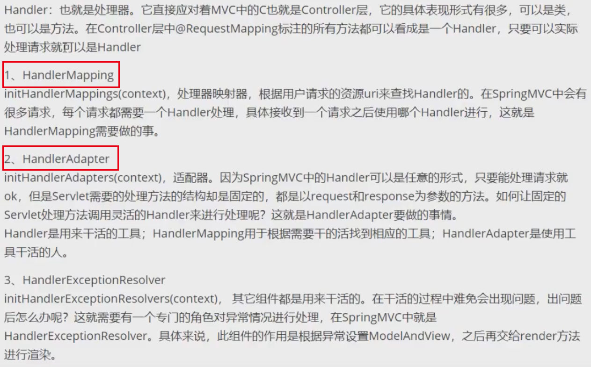
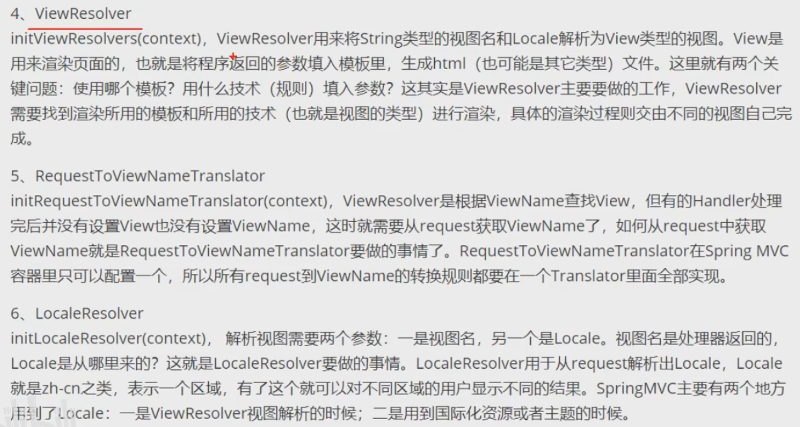
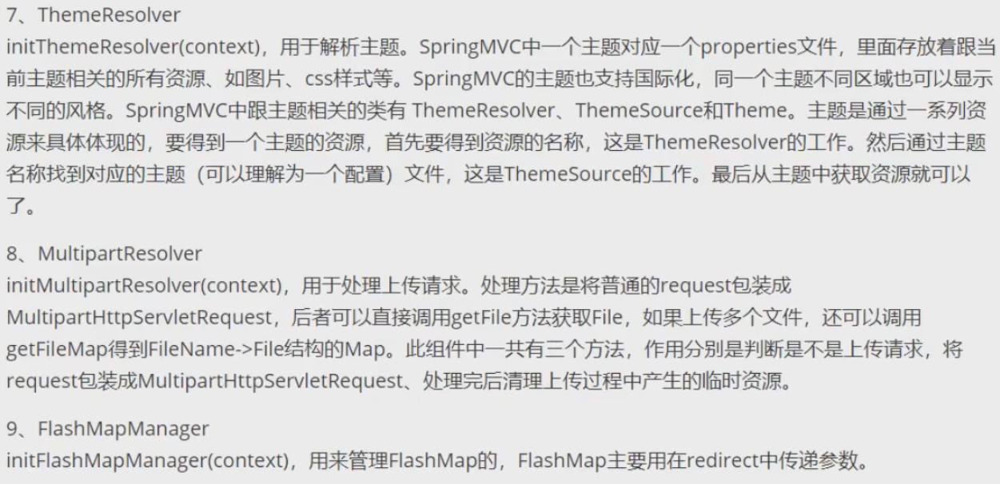
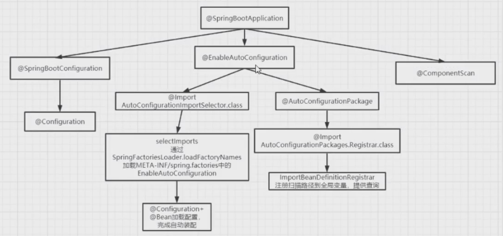
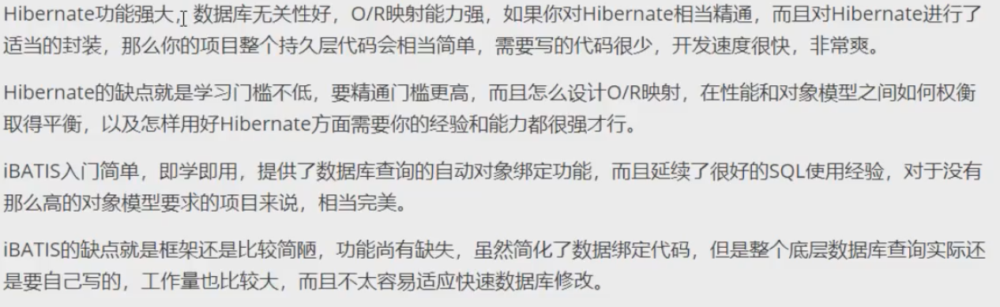
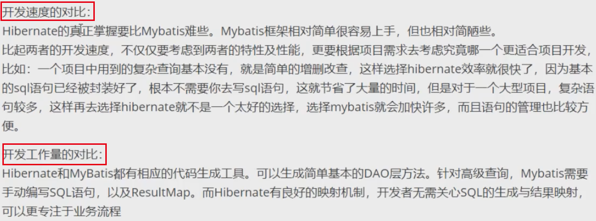
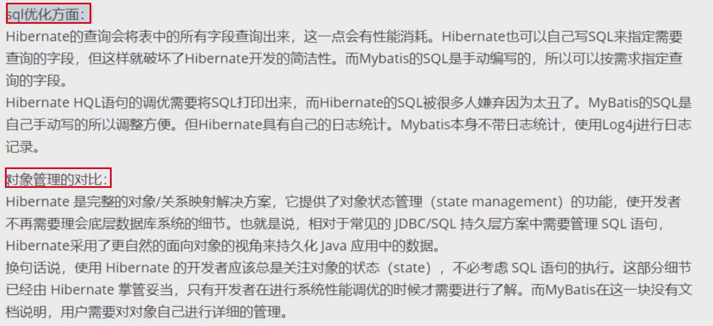
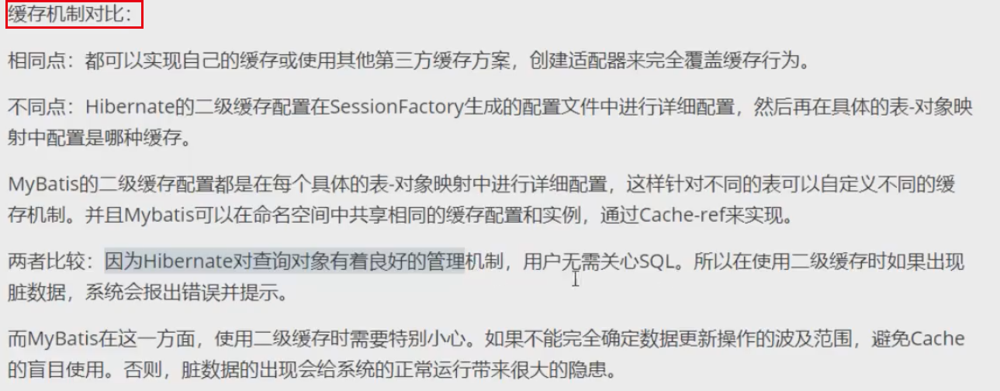
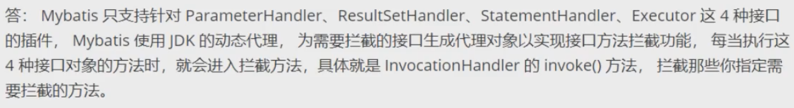
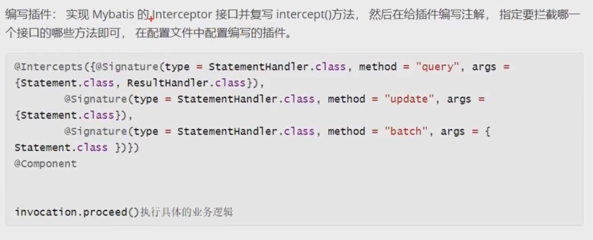

https://www.bilibili.com/video/BV1Z44y1q7wf?from=search&seid=1696733851067838469

# spring是什么

轻量级的开源的J2EE框架。它是一个容器框架，用来装JavaBean（Java对象），还是一个中间层框架，可以起一个连接作用，比如说把struts和hibernate粘合在一起运用，可以让我们的企业开发更快、更简洁。

Spring是一个轻量级的控制反转（IoC）和面向切面（AOP）的容器框架

- 从大小和开销两方面而言，spring都是轻量级的
- 通过控制反转的技术达到松耦合的目的
- 提供了面向切面编程的丰富支持，允许通过分离应用的业务逻辑与系统服务进行内聚性的开发
- 包含并管理应用对象（Bean）的配置和生命周期，这个意义上是一个容器
- 将简单的组件配置、组合为复杂的应用，这个意义上是一个框架

# 谈谈你对AOP的理解

系统是由许多不同的组件所组成的，每一个组件各复制一块特定功能。除了实现自身核心功能之外，这些组件还经常承担着额外的职责。例如日志、事务管理和安全这样的核心服务经常融入到自身具有核心业务功能逻辑的组件中去。这些系统服务经常被称为横切关注点，因为它们会跨越系统的多个组件。

当我们需要为分散的对象引入公共行为的时候，OOP则显得无能为力。也就是说，OOP允许你定义从上到下的关系，但并不适合定义从左到右的关系，例如日志功能。

日志代码往往水平地散布在所有对象层次中，而与它所散布到的对象的核心功能毫无关系。

在OOP设计中，它导致了大量代码的重复，而且不利于各个模块的重用。

**AOP：**将程序中的交叉业务逻辑（比如安全、日志、事务等），封装成一个切面，然后注入到目标对象（具体业务逻辑）中去。AOP可以对某个对象或某些对象的功能进行增强，比如对象中的方法进行增强，可以在执行某个方法之前额外的做一些事情，在某个方法执行之后额外做一些事情。

# 谈谈你对IOC的理解

从容器概念、控制反转、依赖注入三方面理解。

**IOC容器**：实际上就是一个map（key、value），里面存的是各种对象（在xml里配置的bean节点、@repository、@service、@controller、@component），在项目启动的时候会读取配置文件里面的bean节点，根据全限定类名使用反射创建对象放到map里、扫描到打上上述注解的类还是通过反射创建对象放到map里。

这个时候map里就有各种对象了，接下来我们在代码里需要用到里面的对象时，再通过DI（依赖注入）注入（autowired、resource等注解，xml里bean节点内的ref属性，项目启动的时候会读取xml节点ref属性根据id注入，也会扫描这些注解，根据类型或者id注入；id就是对象名）

**控制反转：**

没有引入IOC容器前，对象A依赖于对象B，那么对象A在初始化或者运行到某一点的时候，自己必须主动去创建对象B或者使用以及创建的对象B。无论是创建还是使用对象B，控制权都在自己手上。

引入IOC容器后，对象A与对象B之间失去了直接联系，当对象A运行到需要对象B的时候，**IOC容器会主动创建一个对象B注入到对象A需要的地方。**

通过前后对比，不难看出：对象A获得依赖对象B的过程，由主动行为变为了被动行为，控制权颠倒过来了。这就是“控制反转”这个名称的由来。

全部对象的控制权全部上缴给”第三方"IOC容器，所以IOC容器成了整个系统的关键核心，它起到了一种类似“粘合剂”的作用，把系统中的所有对象粘合在一起发挥作用，如果没有这个“粘合剂”，对象与对象之间会彼此失去联系，这就是有人把IOC容器比喻成“粘合剂”的由来。

**依赖注入：**

“获得依赖对象的过程被反转了”。控制被反转后，获得依赖对象的过程由自身管理变为了由IOC容器主动注入。依赖注入是实现IOC的方法，就是由IOC容器在运行期间，动态地将某种依赖关系注入到对象中。

# BeanFactory和ApplicationContext有什么区别

ApplicationContext是BeanFactory的子接口

ApplicationContext提供了更完整的功能：

​	1、继承MessageSource，因此支持国际化

​	2、统一的资源文件访问方式

​	3、提供在监听器中注册bean的事件

​	4、同时加载多个配置文件

​	5、载入多个（有继承关系）上下文，使得每一个上下文都专注于一个特点的层次，比如应用的web层

BeanFactory采用的是**延迟加载形式**来注入Bean的，即只有在使用到某个Bean的时候（调用getBean()），才对该Bean进行加载实例化。这样，我们就不能发现一些存在的Spring的配置问题。如果Bean的某一个属性没有注入，BeanFactory加载后，直至第一次使用调用getBean()方法才回抛出异常。

ApplicationContext，它是在容器启动的时候，一次性创建了所有的Bean。这样，在容器启动的时候，我们就可以发现Spring中存在的配置错误，这样有利于检查所依赖属性是否注入。ApplicationContext启动后预载入所有的单实例Bean，通过预载入单实例bean，确保当你需要的时候，你就不用等待，因为它们已经创建好了。

相对于基本的BeanFactory，ApplicationContext唯一的不足是占用内存空间。当应用程序配置bean较多时，程序启动较慢。

BeanFactory通常以编程的方式被创建，ApplicationContext还能以声明的方式创建，如使用ContextLoader。

BeanFactory和ApplicationContext都支持BeanPostProcessor、BeanFactoryPostProcessor的使用，但是两者的区别是：BeanFactory需要手动注册，ApplicationContext则是自动注册。

# 简述bean的生命周期

1. 解析类得到BeanDefinition

2. 如果有多个构造方法，则要推断构造方法
3. 确定好构造方法后，进行实例化得到一个对象
4. 对对象中的加了@Autowried注解的属性进行属性填充
5. 回调Aware方法，比如BeanNameAware、BeanFactoryAware
6. 调用BeanPostProcessor的初始化前的方法
7. 回调初始化方法
8. 调用BeanPostProcessor的初始化后的方法，在这里会进行AOP
9. 如果当前创建的bean是单例的，则会把bean放入单例池
10. 在运行期间使用bean
11. Spring容器关闭时调用DisposableBean中的destory()方法

# Spring支持的Bean的作用域

- **singleton（单例模式）：**默认的。每个容器中只有一个bean的实例，单例的模式由BeanFactory自身来维护。该对象的生命周期是与Spring IOC容器一致的（但在第一次被注入时才创建）
- **prototype（原型模式）：**为每一个bean请求提供一个实例。在每次注入时都会创建一个新的对象
- **request：**bean被定义为在每个HTTP请求中创建一个单例对象，也就是说在单个请求中都会复用这一个单例对象。每个请求中只用一个单例对象
- **session：**与request范围类似，确保每个session中有一个bean的实例，在session过期后，bean会随之失效。每个请求中只有一个单例对象
- **global-session：**全局作用域，global-session和Portlet应用相关。当你的应用部署在Protlet容器中工作时，它包含很多protlet。如果你想要声明让所有的protlet共用全局的存储变量的话，那么这全局变量需要存储在global-session中。全局作用域与Servlet中的session作用域效果相同。
- application：bean被定义为在ServletContext的生命周期中复用一个单例对象
- **websocket：**bean被定义为在websocket的生命周期中复用一个单例对象

# spring框架中的单例Bean是线程安全的吗

是不安全的。

spring中的Bean模式是单例模式的，框架并没有对bean进行多线程的封装处理。

如果Bean是有状态的，那就需要开发人员自己来进行线程安全的保证，最简单的方法就是改变bean的作用域，把“singleton”改为“prototype”，这样每次请求Bean就相当于是new Bean()，这样就可以保证线程的安全了。

- 有状态就是有数据存储功能，存在安全问题。
- 无状态就是不会保存数据。 controller、service和dao层本身并不是线程安全的，只是如果只是调用里面的方法，而且多线程调用一个实例的方法，会在内存中复制变量，这是自己的线程的工作内存，是安全的。

Dao会操作数据库Connection，connection是带有状态的，比如说数据库事务，Spring的事务管理器使用**TheadLocal**为不同线程维护了一套独立的connection副本，保证线程之间不会互相影响 <--------- Spring是如何保证事务获取同一个Connection

不要在bean中声明任何有状态的实例变量或类变量，如果必须如此，那么就使用ThreadLocal把变量变为线程私有的，如果bean的实例变量或类变量如要在多个线程之间共享，那么就只能使用synchronized、lock、CAS等这些实现线程同步的方法了。

# Spring框架中都用到了哪些设计模式及应用场景

简单工厂：（不是二十三种之一）由一个工厂类根据传入的参数，动态决定应该创建哪一个产品类

> Spring中的BeanFactory就是简单工厂模式的体现，根据传入一个唯一的标识来获得bean对象，但是否是在传入参数后创建还是传入参数前创建，这个要根据具体情况来定

工厂方法：

> 实现了FactoryBean接口的Bean是一类叫做factory的bean，其特点是，spring会在使用getBean()调用获得该bean时，会自动调用该bean的getObject()方法，所以返回的不是factory这个bean，而是bean.getObject()方法的返回值

单例模式：保证一个类只有一个实例，并提供一个访问它的全局访问点

> spring中对单例的实现：spring中的单例模式完成了后半句话，即提供了全局的访问点BeanFactory，但是没有从构造器级别去控制单例，这是因为spring管理的是任意的java对象

适配器模式：

> 在SpringMVC中有一个HandlerAdater，通过适配器中的handler方法去调用controller中的方法。
>
> spring定义了一个适配器接口，使得每一种controller有一种对应的适配器实现类，让适配器代替controller执行相应的方法，这样在扩展controller的时候，只需要增加一个适配器类就完成了SpringMVC的扩展了。

装饰器模式：动态地给一个对象添加一些额外的职责。就增加功能来说，Decorator模式相比生成子类更为灵活。

> spring中用到的装饰器模式在类名上有两种表现：一种是类名中含有Wrapper，另一种是类名中含有Decorator。

动态代理：

> 在AOP中应用。切面在应用运行的时候被织入。一般情况下，在织入切面时，AOP容器会为目标对象创建动态的创建一个代理对象，SpringAOP就是以这种方式织入切面的。
>
> 织入：把切面应用到目标对象并创建心得代理对象的过程

观察者模式：

> spring的事件驱动模型使用的是观察者模式，Spring中的observer模式常用的地方是listener的实现。

策略模式：

> spring框架的资源访问Resource接口。该接口提供了更强的资源访问能力，Spring框架本身大量使用了Resource接口来访问底层资源。

# Spring事务的实现方式和原理以及隔离级别

**实现方法和原理：**

在使用spring框架时，可以有两种使用事务的方式：一种是**编程式**的，比如代码中使用begin提交事务；一种是**声明式**的，@Transactional注解就是声明式的。

首先，事务这个概念是数据库层面的，spring只是基于数据库中的事务进行了扩展，以及提供了一些能让程序员更加方便操作事务的方式。

比如我们可以通过在某个方法上增加@Transactional注解，就可以开启事务，这个方法中所有的sql都会在一个事务中执行，统一成功或失败。

在一个方法上加了@Transactional注解后，spring就会基于这个类生成一个代理对象，会将这个代理对象作为bean，当在使用这个代理对象的方法时，如果这个方法上存在@Transactional注解，那么代理逻辑会先把事务的自动提交设置为false，然后再去执行原本的业务逻辑方法，如果执行业务逻辑方法没有出现异常，那么代理逻辑中就会将事务进行提交，如果执行业务逻辑方法出现了异常，那么则会将事务进行回滚。

当然，针对哪些异常回滚事务是可以配置的，可以利用@Transactional注解中的rollbackFor属性进行配置，默认情况下会对RuntimeException和Error进行回滚（注意：这些异常不能使用try catch捕获，应该让异常抛出了，这样才回进行回滚）

**隔离级别：**

spring事务的隔离级别就是数据库的隔离级别：外加一个默认级别

- read uncommitted（读未提交）
- read committed（读已提交） （Oracle默认）
- repeatable read（可重复读）（MySQL默认）
- serializable（可串行化）

请问，如果数据库的配置隔离级别是Read Committed，而spring配置的隔离级别是Repeatable Read，这时隔离级别是以哪一个为准？

以spring配置的为准，如果spring设置的隔离级别数据库不支持，效果取决于数据库

# spring的事务的传播机制

多个事务方法相互调用时，事务如何在这些方法之间传播？

> 方法A是一个事务的方法，方法A执行过程中调用了方法B，那么方法B有无事务以及方法B对事务的要求不同都会对方法A的事务具体执行造成影响，同时方法A的事务对方法B的事务执行也有影响，这种影响具体是什么就有两个方法所定义的事务传播类型所决定。

**REQUIRED**（spring默认的事务传播类型）：如果当前（是指调用方）没有事务，则自己（是指被调用方）新建一个事务；如果当前存在事务，则加入这个事务

> a调用b，则a是当前事务

**SUPPORTS**：当前存在事务，则加入当前事务；如果当前没有事务，就以非事务方法执行（非事务方式是指不需要事务）

**MANDATORY**：当前存在事务，则加入当前事务；如果当前事务不存在，则抛出异常

**REQUIRES_NEW**：创建一个新事务，如果存在当前事务，则挂起该事务（挂起当前事务是指各自负责各自的事务，互不干扰）

**NOT_SUPPORTED**：以非事务方式执行；如果当前存在事务，则挂起当前事务

**NEVER**：都不使用事务，如果当前事务存在，则抛出异常

**NESTED**（嵌套事务）：如果当前事务存在，则在嵌套事务中执行，否则和REQUIRED的操作一样，开启一个事务

> 和REQUIRES_NEW的区别：
>
> REQUIRES_NEW是新建一个事务并且新开启的这个事务与原有事务无关，而NESTED则是当前存在事务时（我们把当前事务称之为父事务）会开启一个嵌套事务（称之为子事务），在NESTED情况下父事务回滚时，子事务也会回滚，而在REQUIRES_NEW情况下，原有事务回滚，不会影响新开启的事务。
>
> 和REQUIRED的区别：
>
> REQUIRED情况下，调用方存在事务时，被调用方和调用方使用同一事务，那么被调用方出现异常时，由于共用一个事务，所以无论调用方是否catch其异常，事务都会回滚；而在NESTED情况下，被调用方发生异常时，调用方可以catch其异常，这样具有子事务回滚，父事务不受影响。

# spring事务什么时候会失效

spring事务的原理是AOP，进行了切面增强，那么失效的根本原因是这个AOP不起作用了！常见情况有如下几种：

1. 发生自调用，类里面使用this调用本类的方法（this通常省略），此时这个this对象不是代理类，而是UserService对象本身

   解决办法很简单，让那个this变成UserService的代理类即可

2. 方法不是public的

   @Transactional只能用于public的方法上，否则事务不会失效，如果要用在非public方法上，可以开启AspectJ代理模式

3. 数据库不支持事务：例如MySQL中使用myism引擎

4. 没有被spring管理：加了@Transactional注解，但是类并没有放入IOC容器中

5. 异常被吃掉，事务不会回滚（或者抛出的异常没有被定义，默认为RuntimeException）

# 什么是bean的自动装配，有哪些方式

开启自动装配只需要在xml配置文件<bean>中定义“autowire”属性。

autowire属性有五种装配方式：

- no：缺省情况下，自动配置是通过“ref“属性手动设定

  手动装配：以value或者ref的方式明确指定属性值都是手动装配

  需要通过ref属性来连接bean

- byName：根据bean的属性名称进行自动装配

  ```java
  Cutomer的属性名称是person，spring会将bean id为person的bean通过setter方法进行自动装配
  <bean id="cutomer" class="com.xxx.xxx.Cutomer" autowire="byName"/>
  <bean id="persion" class="com.xxx.xxx.Person" />
  ```

- byType：根据bean的类型进行自动装配

  ```java
  Cutomer的属性person的类型是Person，spring会将Person类型通过setter方法进行自动装配
  <bean id="cutomer" class="com.xxx.xxx.Cutomer" autowire="byType"/>
  <bean id="persion" class="com.xxx.xxx.Person" />
  ```

- constructor（构造器）：类似byType，不过是应用于构造器的参数。如果一个bean与构造器参数的类型相同，则进行自动装配，否则导致异常

  ```java
  Cutomer构造函数的参数person的类型是Person，spring会将Person类型通过构造方法进行自动装配
  <bean id="cutomer" class="com.xxx.xxx.Cutomer" autowire="constructor"/>
  <bean id="persion" class="com.xxx.xxx.Person" />
  ```

- autodetext：如果有默认的构造器，则通过constructor方式进行自动装配，否则使用byType方式进行自动装配

- @Autowired自动装配bean，可以在字段、setter方法、构造函数上使用

# spring、springMVC、springboot有什么区别

spring是一个IOC容器，用来管理bean，使用依赖注入实现控制反转，可以很方便的整个各种框架，提供AOP机制弥补OOP的代码重复问题，更方便将不同类不同方法中的共同处理抽取成切面、自动注入给方法执行，比如日志、异常等。

springmvc是spring对web框架的一个解决方案，提供了一个总得前端控制权Servlet，用来接受请求，然后定义了一套路由策略（url到handle的映射）以及适配执行handle，将handle结果使用视图解析技术生成视图展现给前端。

springboot是spring提供的一个快速开发工具包，让程序员能更方便、更快速的开发spring+springmvc应用，简化了配置（约定大于配置），整合了一系列的解决方案（starter机制）、redis、MongoDB、es，可以开箱即用

# springmvc工作流程

1. 用户发送请求至前端控制器（DispatcherServlet）
2. 前端控制器收到请求调用处理器映射器（HandlerMapping）
3. 处理器映射器找到具体的处理器（可以根据xml配置、注解进行查找），生成处理器及处理器拦截器（如果有则生成）一并返回给前端控制器
4. 前端控制器调用处理器适配器（HandlerAdapter）
5. 处理器适配器经过适配调用具体的处理器（controller，也叫后端控制器）
6. 后端控制器执行完成返回ModelAndView
7. 处理器适配器将后端控制器执行结果ModelAndView返回给前端控制器
8. 前端控制器将ModelAndView传给视图解析器（ViewReslover）
9. 视图解析器解析后返回具体view
10. 前端控制器根据view进行渲染视图（即将模型数据填充至视图中）
11. 前端控制器响应用户

# springmvc的主要组件（九大组件） 







# springboot自动配置原理

@Impot + @Configuration + spring spi机制

自动配置类由各个starter提供，使用@Configuration +@Bean定义配置类，放到META-INF/spring.factories下

使用Spring spi扫描META-INF/spring.factories下的配置类

使用@Import导入自动配置类



# 如何理解springboot中的starter

使用spring+springmvc的时候，如果需要引入mybatis等框架，需要到xml中定义mybatis需要的bean

starter就是定义一个starter的jar包，写一个@Configuration配置类，将这些bean定义在里面，然后再starter包的META-INF/spring.factories中写入该配置类，springboot会按照约定来加载该配置类

开发人员只需要将相应的starter包依赖进该应用，进行相应的属性配置（使用默认配置时，不需要配置），就可以直接进行代码开发，使用对应的功能了，比如mybatis-spring-boot-starter、spring-boot-starter-redis

# 什么是嵌入式服务器？为什么要是用嵌入式服务器？

节省了下载按照Tomcat，应用也不需要再打包war包，然后放到webapp目录下在运行

只需要一个安装了java的虚拟机，就可以直接在上面部署应用程序了

springboot已经内置了tomcat.jar，运行main方法时会去启动tomcat，并利用tomcat的spi机制加载springmvc

# mybatis的优缺点

优点：

1. 基于sql语句编程，相当灵活，不会对应用程序或者数据库的现有设计造成任何影响，SQL写在XML里，解除了sql与应用程序的耦合，便于统一管理；提供XML标签，支持编写动态SQL语句，并可重用
2. 与JDBC相比，减少了50%以上的代码量，消除了JDBC大量冗余的代码，不需要手动开关连接
3. 很好的与各种数据库兼容（因为mybatis使用JDBC来连接数据库，所以只要JDBC支持的数据库mybatis都支持）
4. 能够与spring很好的集成
5. 提供映射标签，支持对象与数据库的ORM字段关系映射；提供对象关系映射标签，支持对象关系组件维护

缺点：

1. SQL语句的编写工作量大，尤其当字段多、关联表多时，对开发人员编写SQL语句的功底有一定要求
2. SQL语句依赖于数据库，导致数据库移植性差，不能随意更换数据库

# mybatis与hibernate有哪些不同









# #{}和${}的区别

#{} 是预编译处理、是占位符

${} 是字符串替换、是拼接符

mybatis在处理 #{} 时，会将sql中的 #{} 替换为 ？ 号，调用PreparedStatement来赋值；

mybatis在处理 ${} 时，就是把 ${} 替换成变量的值，调用Statement来赋值；

#{} 的变量替换是在DBMS中的，变量替换后，#{} 对应的变量自动加上单引号

${} 的变量替换是在DBMS外的，变量替换后，${} 对应的变量不会自动加载单引号

使用 #{} 可以有效的防止sql注入，提高系统的安全性

# 简述mybatis的插件运行原理，如何编写一个插件




