# 索引的基本原理

索引是用来快速地寻找那些具有特定值的记录。如果没有索引，一般来说执行查询时遍历整张表。

索引的原理：就是把无序的数据变成有序的查询

1、把创建了索引的列的内容进行排序

2、对排序结果生成倒排表

3、在倒排表内容上拼上数据地址链

4、在查询时，先拿到倒排表内容，再取出数据地址链，从而拿到具体数据

# mysql聚簇索引和非聚簇索引的区别

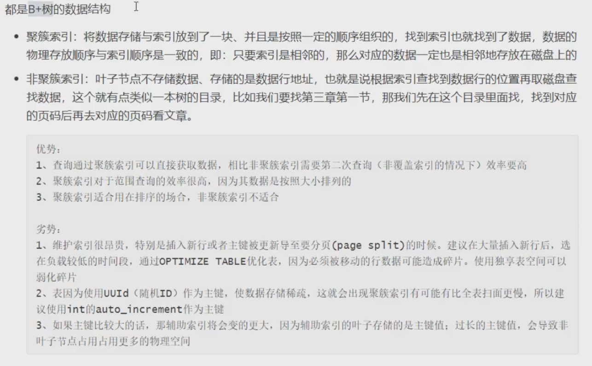

# mysql索引的数据结构，各自的优劣

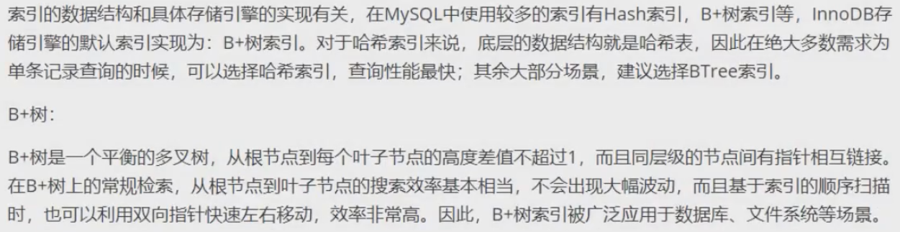

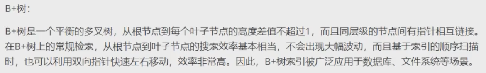

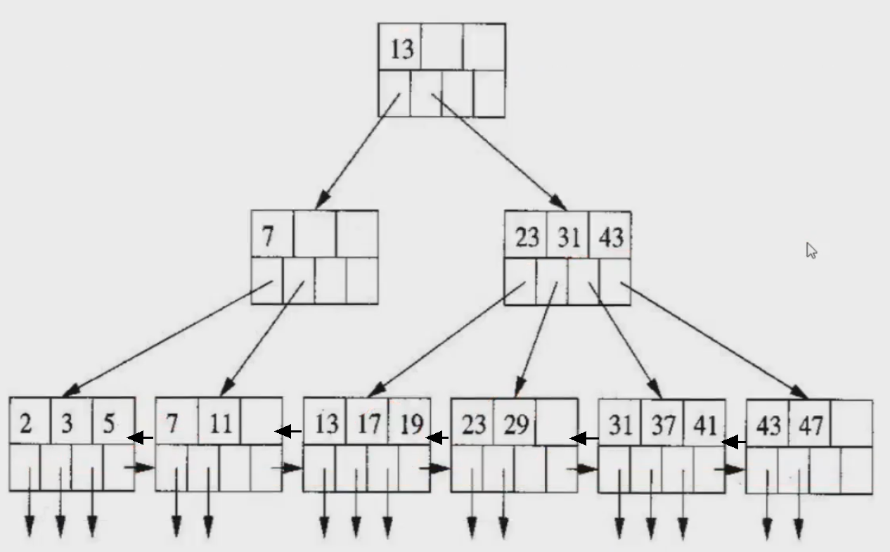

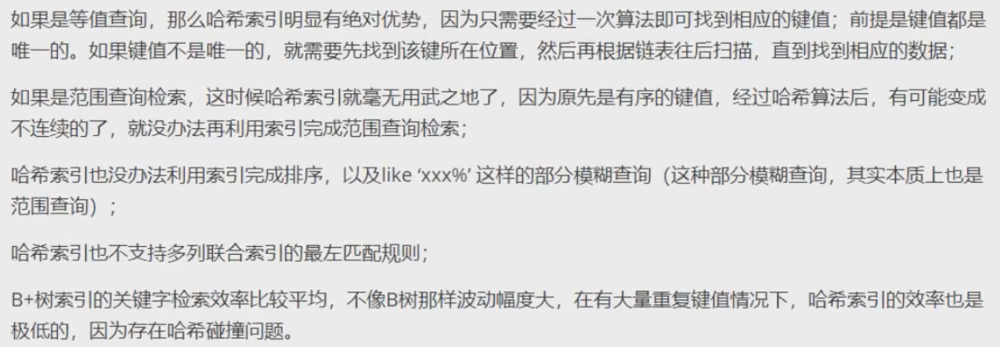

# 索引的设计原则

查询更快、占用空间更小

适合建立索引：

1. 适合索引的列是出现在where子句中的列，或者连接子句中指定的列
2. 基数较小的表，索引效果较差，没有必要在此列建立索引
3. 使用短索引，如果对长字符串列进行索引，应该指定一个前缀长度，这样能够节省大量索引空间，如果搜索词超过索引前缀长度，则使用索引排除不匹配的行，然后检查其余行是否匹配
4. 不要过度索引。索引需要额外的磁盘空间，并降低了写操作的性能。在修改表内容的时候，索引会进行更新甚至重构，索引列越多，这个时间越长。所以只保持需要的索引有利于查询即可。
5. 定义有外键的数据列一定要建立索引，

不适合建立索引：

1. 更新频繁的字段不适合创建索引
2. 若是不能有效区分数据的列不适合做索引列（如性别，最多三种，区分度太低）
3. 尽量的扩展索引，不要新建索引。比如表中已经有a的索引，现在要加（a,b）索引，那么只需要修改原来的索引即可
4. 对于那些查询中很少涉及到的列，重复值比较多的列不要建立索引
5. 对于定义为text、image和bit的数据类型的列不要建立索引

# mysql锁的类型有哪些

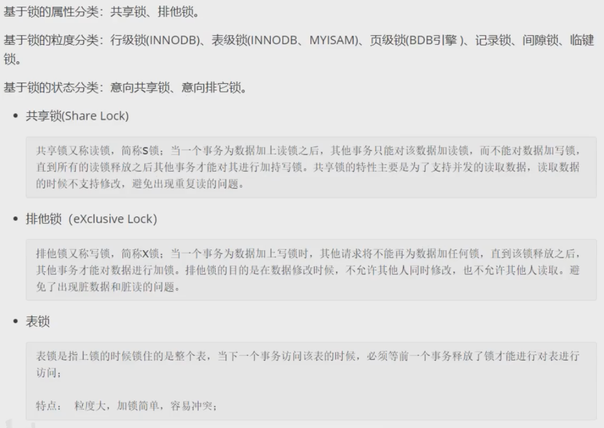

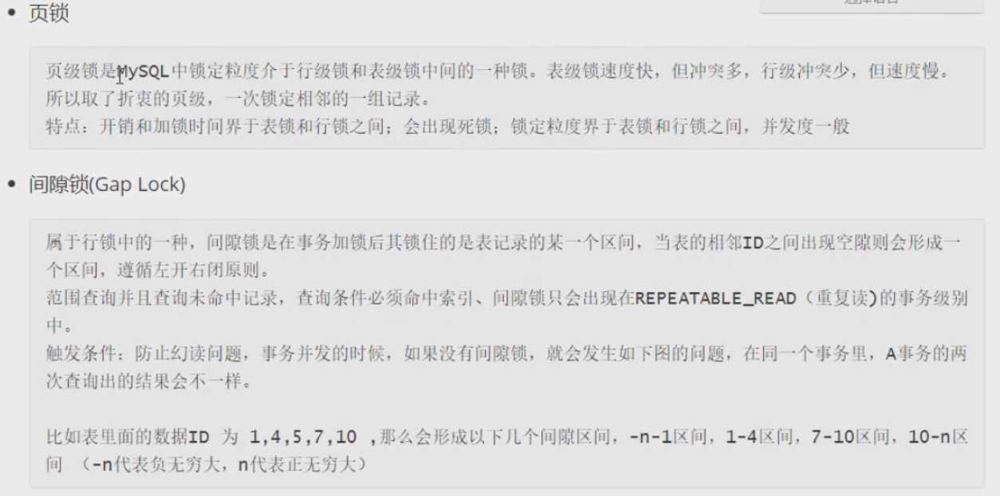

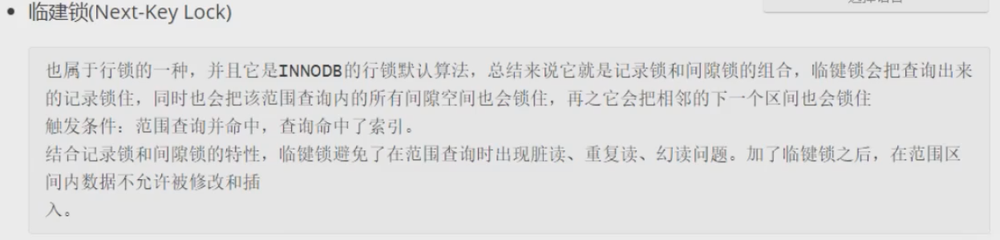

# 事务的基本特性和隔离级别

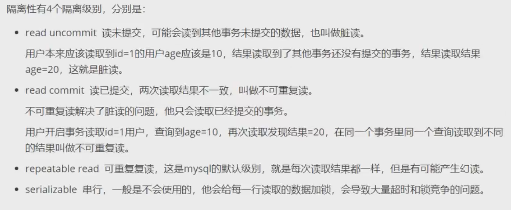

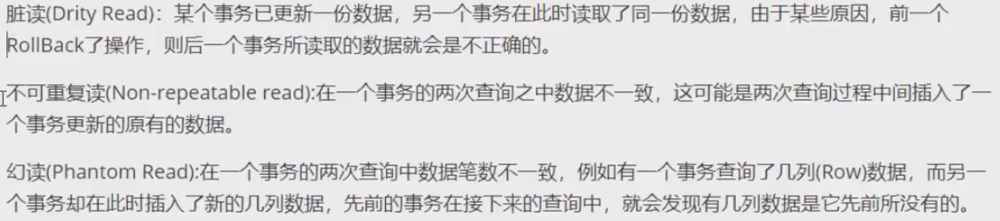

# 关心过业务系统里面的sql耗时吗？统计过慢查询吗？对慢查询都怎么优化过？

慢查询，顾名思义，执行很慢的查询。有多慢？超过 long_query_time 参数设定的时间阈值（默认10s），就被认为是慢的，是需要优化的。慢查询被记录在慢查询日志里。

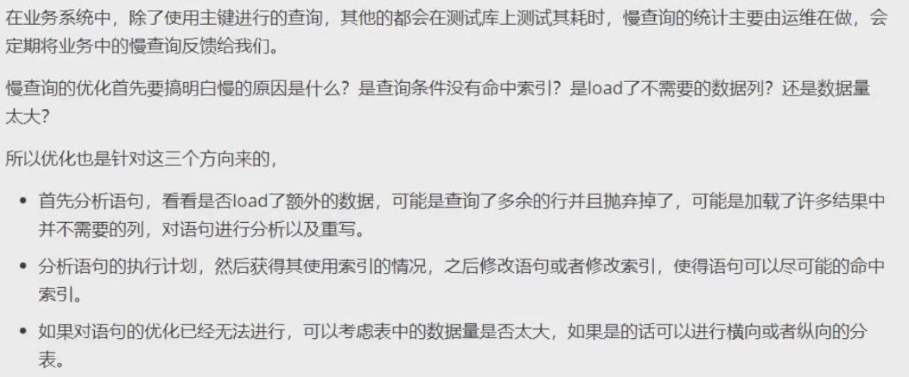

# ACID靠什么保证

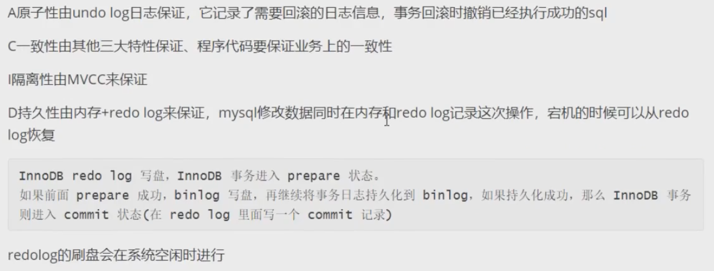

# 什么是MVCC

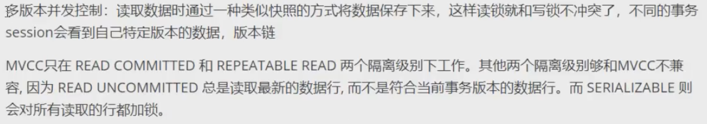

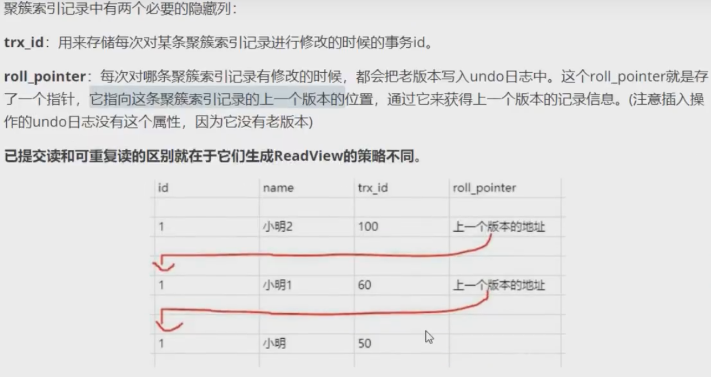

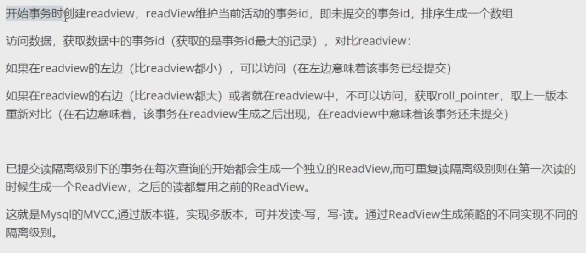

# mysql主从同步原理

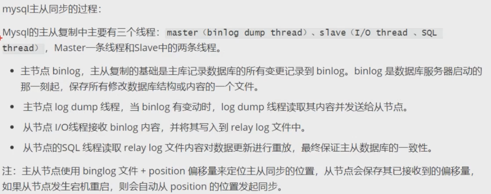

# MyISAM和InnoDB的区别

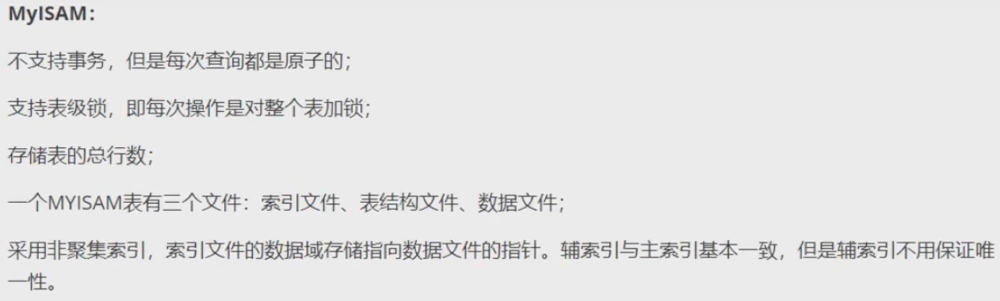

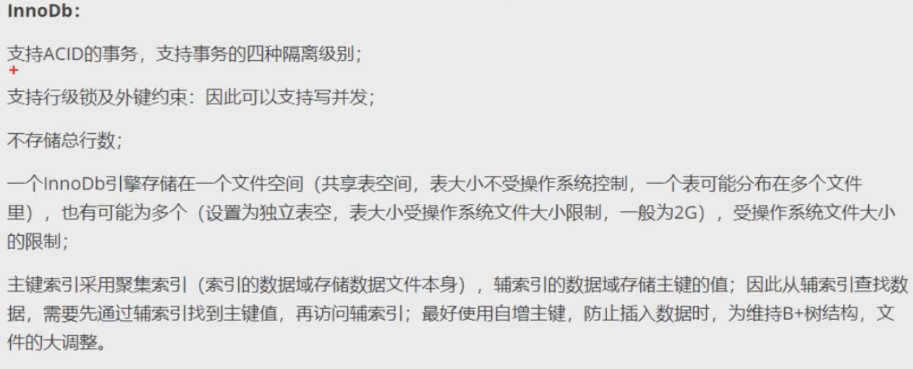

# 简述mysql中索引类型及对数据库的性能的影响

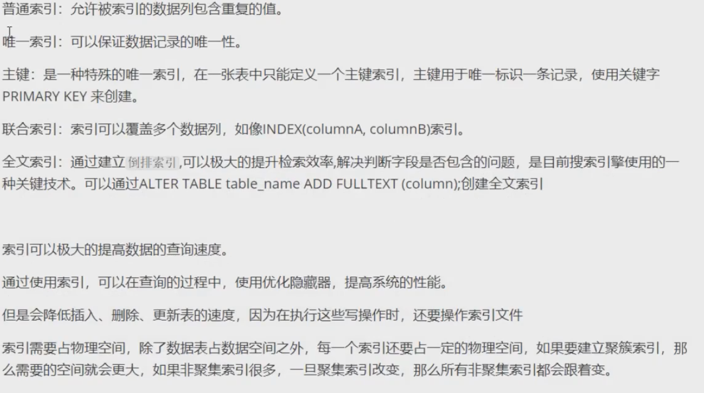

# Redis中的RDB和AOF机制

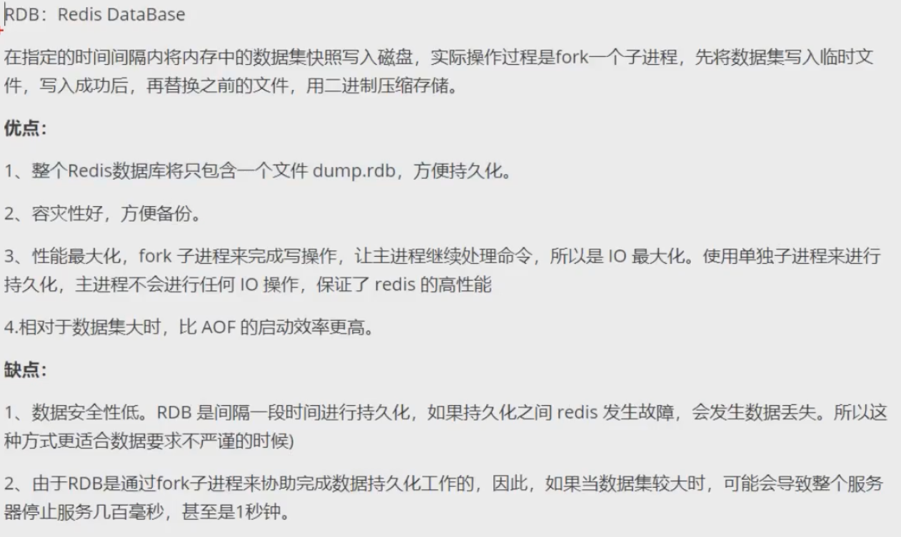

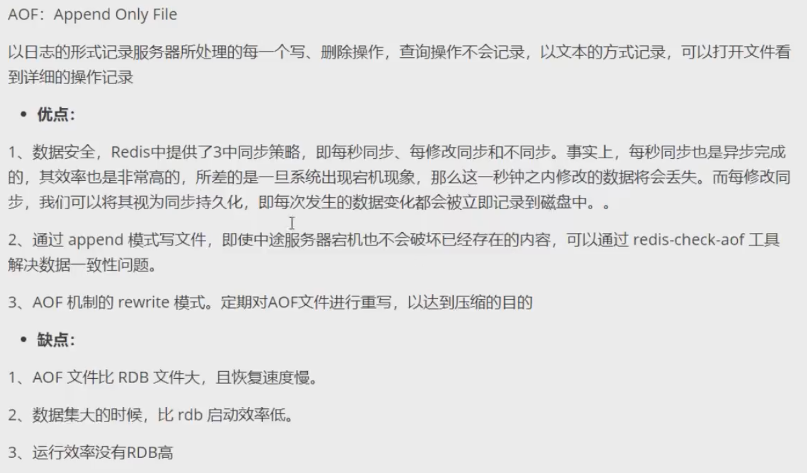

# redis过期键的删除策略

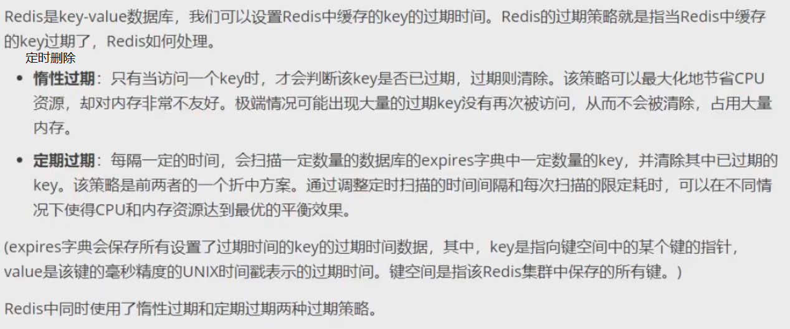

# redis的线程模型，以及redis单线程为什么快

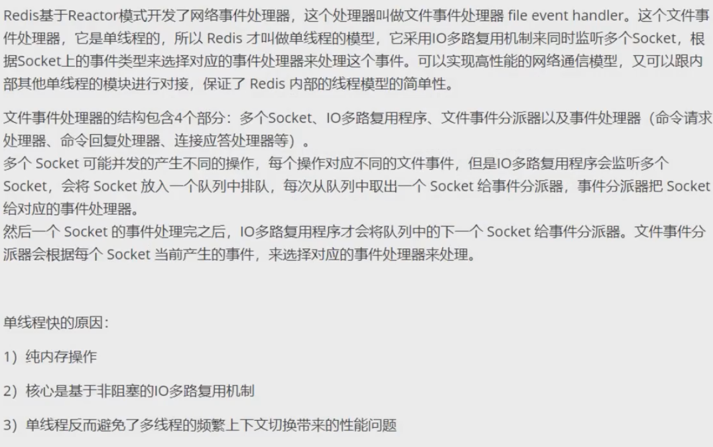

# redis缓存雪崩、缓存穿透、缓存击穿

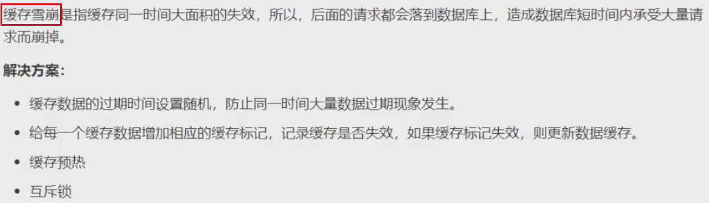

