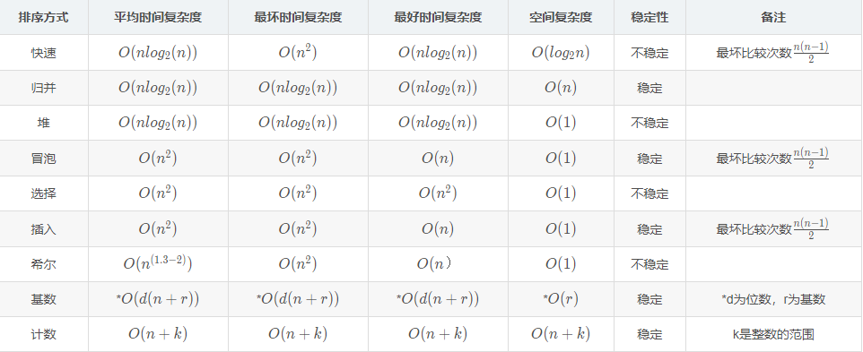
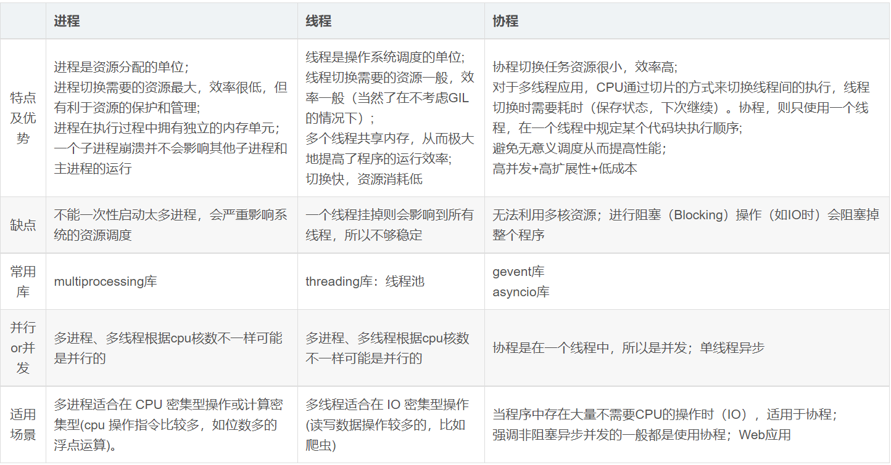
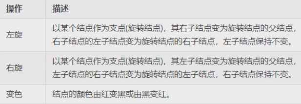
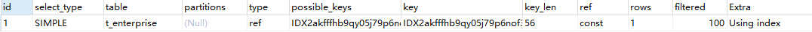
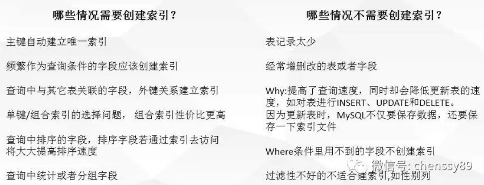

# MySQL索引底层实现？(B+树那些)

# 堆区和栈区区别

**1.申请方式不同**

栈：有系统自动分配。例如：在函数中定义一个局部变量 int a = 0; 系统会在栈上自动开辟相应大小。注意：系统首先会去查看栈上是否有足够的区域去开辟该空间，如果有就直接开辟，如果没有则栈溢出

堆：由程序员自己去申请开辟，并且指明大小。(利用new/malloc)

**2.申请大小的限制**

栈：在Windows下,栈是向低地址扩展的数据结构，是一块连续的内存的区域。这句话的意思是栈顶的地址和栈的最大容量是系统预先规定好的，在WINDOWS下，栈的大小是2M（也有的说是1M，总之是一个编译时就确定的常数），如果申请的空间超过栈的剩余空间时，将提示overflow。因此，能从栈获得的空间较小。

堆：堆是向高地址扩展的数据结构，是不连续的内存区域。这是由于系统是用链表来存储的空闲内存地址的，自然是不连续的，而链表的遍历方向是由低地址向高地址。堆的大小受限于计算机系统中有效的虚拟内存。由此可见，堆获得的空间比较灵活，也比较大。

**3.申请效率的比较**

栈：由系统自动分配，速度较快。但程序员是无法控制的。

堆：是由new/malloc分配的内存，一般速度比较慢，而且容易产生内存碎片,不过用起来最方便.（new/malloc后一定要显示的调用free/delete去释放内存）

**4.堆和栈中的存储内容**

栈： 在函数调用时，第一个进栈的是主函数中后的下一条指令（函数调用语句的下一条可执行语句）的地址，然后是函数的各个参数，在大多数的C编译器中，参数是由右往左入栈的，然后是函数中的局部变量。注意静态变量是不入栈的。

当本次函数调用结束后，局部变量先出栈，然后是参数，最后栈顶指针指向最开始存的地址，也就是主函数中的下一条指令，程序由该点继续运行。

堆：一般是在堆的头部用一个字节存放堆的大小。堆中的具体内容有程序员安排。

**5.底层不同**

栈：是连续的空间。在栈上所申请的内存空间，当我们出了变量所在的作用域后，系统会自动我们回收这些空间。

堆：不是连续的空间。而在堆上申请的空间，当出了相应的作用域以后，我们需要显式 的调用delete来释放所申请的内存空间，如果我们不及时得对这些空间进行释放，那么内存中的内存碎片就越来越多，从而我们的实际内存空间也就会变的越 来越少。

# 浅拷贝和深拷贝

浅拷贝只复制指向某个对象的指针，而不复制对象本身，新旧对象还是共享同一块内存。但深拷贝会另外创造一个一模一样的对象，新对象跟原对象不共享内存，修改新对象不会改到原对象。

# 数组和链表的区别

| 比较项   |                             数组                             |                             链表                             |
| -------- | :----------------------------------------------------------: | :----------------------------------------------------------: |
| 逻辑结构 | （1）数组在内存中连续； (2)使用数组之前，必须事先固定数组长度，不支持动态改变数组大小；(3) 数组元素增加时，有可能会数组越界；(4) 数组元素减少时，会造成内存浪费；（5）数组增删时需要移动其它元素 | （1）链表采用动态内存分配的方式，在内存中不连续 (2)支持动态增加或者删除元素 (3)需要时可以使用malloc或者new来申请内存，不用时使用free或者delete来释放内存 |
| 内存结构 |          数组从栈上分配内存，使用方便，但是自由度小          |       链表从堆上分配内存，自由度大，但是要注意内存泄漏       |
| 访问效率 |       数组在内存中顺序存储，可通过下标访问，访问效率高       |      链表访问效率低，如果想要访问某个元素，需要从头遍历      |
| 越界问题 |          数组的大小是固定的，所以存在访问越界的风险          |          只要可以申请得到链表空间，链表就无越界风险          |

# 各种排序算法时间复杂度



# linux取最后五行数据

 1、cat filename 打印文件所有内容

 2、tail -n 1000 打印文件最后1000行的数据

 3、tail -n +1000 打印文件第1000行开始以后的内容

 4、head -n 1000 打印前1000的内容

# linux统计仅一小时访问量最大的ip

```shell
cat ip.txt|awk -F" " '{print $2}'|sort|uniq -c|sort -nrt " "|awk -F" " '{print $2}'|head -10  
```

sort 对输出ip进行排序
uniq -c 检查及删除文本文件中重复出现的行列 -c或–count 在每列旁边显示该行重复出现的次数。
此时输出的数据格式为 出现次数 ip
sort -nrt " " 对输出结果排序 -n ： 依照数值的大小排序 -r : 以相反的顺序来排序 -t : <分隔字符> 指定排序时所用的栏位分隔字符
接着继续用awk 将数据第二列ip输出
head -10 取前十条数据

# 为什么是四次挥手2MSL

当客户端进入TIME-WAIT状态的时候(也就是第四次挥手的时候)，必须经过时间计数器设置的时间2MSL(最长报文段寿命)后，才能进入关闭状态，这时为什么呢？？？ 

**等待2MSL时间主要目的是怕最后一个ACK包对方没收到，那么对方在超时后将重发第三次握手的FIN包，主动关闭端接到重发的FIN包后可以再发一个ACK应答包**。

1、为了保证客户端发送的最后一个ACK报文段能够到达服务器。因为这个ACK有可能丢失，从而导致处在LAST-ACK状态的服务器收不到对FIN-ACK的确认报文。服务器会超时重传这个FIN-ACK，接着客户端再重传一次确认，重新启动时间等待计时器。最后客户端和服务器都能正常的关闭。假设客户端不等待2MSL，而是在发送完ACK之后直接释放关闭，一但这个ACK丢失的话，服务器就无法正常的进入关闭连接状态。

2、他还可以防止已失效的报文段。客户端在发送最后一个ACK之后，再经过经过2MSL，就可以使本链接持续时间内所产生的所有报文段都从网络中消失。从保证在关闭连接后不会有还在网络中滞留的报文段去骚扰服务器。

注意：在服务器发送了FIN-ACK之后，会立即启动超时重传计时器。客户端在发送最后一个ACK之后会立即启动时间等待计时器。

# 怎么解决的幻读

1. 多版本并发控制（MVCC）（快照读/一致性读）

   多数数据库都实现了多版本并发控制，并且都是靠保存数据快照来实现的。

   以 `InnoDB` 为例。可以理解为每一行中都冗余了两个字段，一个是行的创建版本，一个是行的删除（过期）版本。

   具体的版本号（trx_id）存在 `information_schema.INNODB_TRX` 表中。

   版本号（trx_id）随着每次事务的开启自增。

   事务每次取数据的时候都会取创建版本小于当前事务版本的数据，以及过期版本大于当前版本的数据。

   普通的 select 就是快照读。

   ```sql
   select * from T where number = 1;
   ```

   原理：将历史数据存一份快照，所以其他事务增加与删除数据，对于当前事务来说是不可见的。

2. next-key 锁 （当前读）

   next-key 锁包含两部分

   - 记录锁（行锁）
   - 间隙锁

   记录锁是加在索引上的锁，间隙锁是加在索引之间的

   原理：将当前数据行与上一条数据和下一条数据之间的间隙锁定，保证此范围内读取的数据是一致的。

# go和java的区别

1、函数重载

Go上不允许函数重载，必须具有方法和函数的唯一名称。java允许函数重载。

2、速度

go的速度比java快

3、多态

Java默认允许多态。而Go没有。

4、路由配置

Go语言使用HTTP协议进行路由配置；而，java使用Akka.routing.ConsistentHashingRouter和Akka.routing.ScatterGatherFirstCompletedRouter进行路由配置。

5、可扩展性

Go代码可以自动扩展到多个核心；而，Java并不总是具有足够的可扩展性。

6、继承

Go语言的继承通过匿名组合完成：基类以Struct的方式定义，子类只需要把基类作为成员放在子类的定义中，支持多继承。

Java的继承通过extends关键字完成，不支持多继承。

# 说一下线程、进程、协程

协程是一种用户级的轻量级线程。协程拥有自己的寄存器上下文和栈。协程调度切换时，将寄存器上下文和栈保存到其他地方，在切回来的时候，恢复先前保存的寄存器上下文和栈。因此：

协程能保留上一次调用时的状态（即所有局部状态的一个特定组合），每次过程重入时，就相当于进入上一次调用的状态，换种说法：进入上一次离开时所处逻辑流的位置。



# 场景题：如果一个请求比较慢，可能有什么原因

# 场景题：就上面那个场景，谈一下秒杀中需要注意的时

# 设计题：设计一个等待通知的模式，读写按照顺序，不能用锁

# 栈溢出几种情况

一、局部数组过大。当函数内部的数组过大时，有可能导致堆栈溢出。

二、递归调用层次太多。递归函数在运行时会执行压栈操作，当压栈次数太多时，也会导致堆栈溢出。

三、指针或数组越界。这种情况最常见，例如进行字符串拷贝，或处理用户输入等等。

# 虚拟机允许的栈深度多少？栈大约有多大？

通常栈大小为1M

# shell统计目录下所有的java文件共多少行用什么命令

列出文件
**ls -l**
然后要统计文件有多少个
**grep ‘^d’**
再要统计文件有多少行
**wc -l**

# 红黑树

红黑树是一种自平衡的二叉查找树，除了符合二叉查找树的基本特性外，还具有以下特性：

1.根节点是黑色。

2.节点是红色或黑色。

3.每个叶子节点都是黑色的空节点（NIL节点）。

4 每个红色节点的两个子节点都是黑色。(从每个叶子到根的所有路径上不能有两个连续的红色节点)

5.从任一节点到其每个叶子的所有路径都包含相同数目的黑色节点。

红黑树能自平衡，是依靠三种操作：左旋、右旋和染色



# B+树

**B+树的特征：**

- 有m个子树的中间节点包含有m个元素（B树中是k-1个元素），每个元素不保存数据，只用来索引；
- 所有的叶子结点中包含了全部关键字的信息，及指向含有这些关键字记录的指针，且叶子结点本身依关键字的大小自小而大的顺序链接。 (而B 树的叶子节点并没有包括全部需要查找的信息)；
- 所有的非终端结点可以看成是索引部分，结点中仅含有其子树根结点中最大（或最小）关键字。 (而B 树的非终节点也包含需要查找的有效信息)；

**为什么说B+树比B树更适合数据库索引？**

1）B+树的磁盘读写代价更低

　　B+树的内部结点并没有指向关键字具体信息的指针。因此其内部结点相对B 树更小。如果把所有同一内部结点的关键字存放在同一盘块中，那么盘块所能容纳的关键字数量也越多。一次性读入内存中的需要查找的关键字也就越多。相对来说IO读写次数也就降低了；

2）B+树查询效率更加稳定

　　由于非终结点并不是最终指向文件内容的结点，而只是叶子结点中关键字的索引。所以任何关键字的查找必须走一条从根结点到叶子结点的路。所有关键字查询的路径长度相同，导致每一个数据的查询效率相当；

3）B+树便于范围查询（最重要的原因，范围查找是数据库的常态）

　　B树在提高了IO性能的同时并没有解决元素遍历的我效率低下的问题，正是为了解决这个问题，B+树应用而生。B+树只需要去遍历叶子节点就可以实现整棵树的遍历。而且在数据库中基于范围的查询是非常频繁的，而B树不支持这样的操作或者说效率太低

# CMS发生STW的两个阶段

初始标记和重新标记

# 三色标记算法

三色标记法是一种垃圾回收法，它可以让JVM不发生或仅短时间发生STW(Stop The World)，从而达到清除JVM内存垃圾的目的。JVM中的**CMS、G1垃圾回收器**所使用垃圾回收算法即为三色标记法。

把遍历对象图过程中遇到的对象，按照”是否访问过“这个条件标记成黑、灰、白，三种颜色。

**白色**：表示对象尚未被垃圾收集器访问过。在可达性分析刚刚开始的阶段，所有的对象都是白色的，若在分析结束的阶段，仍然是白色的对象，说明不可达。（对象垃圾）

**黑色**：表示对象已经被垃圾收集器访问过，且这个对象的所有引用都已经扫描过。（程序所需要的对象）

**灰色**：表示对象已经被垃圾收集器访问过，但这个对象上至少存在一个引用还没有被扫描过。（GC需要从此对象中去寻找垃圾）

**算法流程**：

从我们`main`方法的根对象（JVM中称为`GC Root`）开始沿着他们的对象向下查找，用黑灰白的规则，标记出所有跟`GC Root`相连接的对象,扫描一遍结束后，一般需要进行一次短暂的STW(Stop The World)，再次进行扫描，此时因为黑色对象的属性都也已经被标记过了，所以只需找出灰色对象并顺着继续往下标记（且因为大部分的标记工作已经在第一次并发的时候发生了，所以灰色对象数量会很少，标记时间也会短很多）, 此时程序继续执行，`GC`线程扫描所有的内存，找出扫描之后依旧被标记为白色的对象（垃圾）,清除。

具体流程:

1. 首先创建三个集合：白、灰、黑。
2. 将所有对象放入白色集合中。
3. 然后从根节点开始遍历所有对象（注意这里并不**递归遍历**），把遍历到的对象从白色集合放入灰色集合。
4. 之后遍历灰色集合，将灰色对象引用的对象从白色集合放入灰色集合，之后将此灰色对象放入黑色集合
5. 重复 4 直到灰色中无任何对象
6. 通过write-barrier检测对象有变化，重复以上操作
7. 收集所有白色对象（垃圾）

**三色标记存在问题**

1. 浮动垃圾：并发标记的过程中，若一个已经被标记成黑色或者灰色的对象，突然变成了垃圾，由于不会再对黑色标记过的对象重新扫描,所以不会被发现，那么这个对象不是白色的但是不会被清除，重新标记也不能从`GC Root`中去找到，所以成为了浮动垃圾，**浮动垃圾对系统的影响不大，留给下一次GC进行处理即可**。
2. 对象漏标问题（需要的对象被回收）：并发标记的过程中，一个业务线程将一个未被扫描过的白色对象断开引用成为垃圾（删除引用），同时黑色对象引用了该对象（增加引用）（这两部可以不分先后顺序）；因为黑色对象的含义为其属性都已经被标记过了，重新标记也不会从黑色对象中去找，导致该对象被程序所需要，却又要被GC回收，此问题会导致系统出现问题，而`CMS`与`G1`，两种回收器在使用三色标记法时，都采取了一些措施来应对这些问题，**CMS对增加引用环节进行处理（Increment Update），G1则对删除引用环节进行处理(SATB)。**

# 快速排序

先把数组中的一个数当作基准数，一般会把数组中最左边的数当作基准数，然后从两边进行检索。先从右边检索比基准数小的，再从左边检索比基准数大的。如果检索到，就停下，然后交换这两个元素。然后继续检索。

i和j一旦相遇，就停止检索，把基准数和相遇位置的元素交换。交换完成后，表示第一轮排序结束了，此时基准数左边都比它小，右边都比它大。

第二轮和第一轮一样，以后先排基准数左边，排完之后再排基准数右边，方法和第一轮一样。

```java
public class QuickSort {
    public static void main(String[] args) {
        int[] nums = new int[]{6,3,7,9,5,1,4,8};
        quickSort(nums,0,nums.length-1);
        for (int i = 0; i < nums.length; i++) {
            System.out.print(nums[i] + " ");
        }
    }

    // 用来进行快速排序
    public static void quickSort(int[] arr,int left,int right){
        // 如果左边索引大于右边索引，不合法，直接return
        if (left > right)
            return;

        // 定义变量保存基准数,把最左边的当作基准数
        int base = arr[left];
        // 定义变量i指向最左边
        int i = left;
        // 定义变量j指向最右边
        int j = right;

        // i和j不相遇的时候，在循环中进行检索
        while (i != j){
            // 先由j从右往左检索比基准数小的，如果检索到比基准数小的，就停下
            // 如果检索到比基准数大的或者相等的，就继续检索
            while (arr[j] >= base && i < j){
                j--; // j 从右往左移动
            }
            // 先由i从左往右检索比基准数大的，如果检索到比基准数大的，就停下
            // 如果检索到比基准数小的或者相等的，就继续检索
            while (arr[i] <= base && i < j){
                i++; // i 从左往右移动
            }

            // 如果代码走到这里。i j 停下，说明都找到了，然后交换i j位置的元素
            int temp = arr[i];
            arr[i] = arr[j];
            arr[j] = temp;
        }
        // 如果上面while循环的条件不成立，就跳出循环
        // 如果条件不成立，说明i和j相遇了
        // i和j相遇了，则交换基准数和这个相遇位置的元素
        arr[left] = arr[i];
        arr[i] = base;  // 使用base，不要重新定义一个中间变量

        // 基准数在这里就归位了，左边比它小，右边比它大

        // 排基准数左边的
        quickSort(arr,left,i-1);
        // 排基准数右边的
        quickSort(arr,i+1,right);

    }
}

```

# CMS和G1的区别

**区别一： 使用范围不一样**

​	CMS收集器是老年代的收集器，可以配合新生代的Serial和ParNew收集器一起使用
​	G1收集器收集范围是老年代和新生代。不需要结合其他收集器使用

**区别二： STW的时间**

​	CMS收集器以最小的停顿时间为目标的收集器。

​	G1收集器可预测垃圾回收的停顿时间（建立可预测的停顿时间模型）

**区别三： 垃圾碎片**

​	CMS收集器是使用“标记-清除”算法进行的垃圾回收，容易产生内存碎片

​	G1收集器使用的是“标记-整理”算法，进行了空间整合，降低了内存空间碎片。

**区别四： 垃圾回收的过程不一样**

​	CMSde 最后一个过程是并发清除，而G1的最后一个过程是筛选回收（对每个Region的回收成本进行排序，按照用户自定义的回收时间来制定回收计划）

# 为什么G1要根据回收成本进行排序

# AQS

# B+树中非叶节点中指针有什么用

# explain查看索引的使用情况

```shell
EXPLAIN select id from t_enterprise WHERE credit_code = "91310112MA1GD5W87M"
```



**id**

1. select 查询的序列号，包含一组可以重复的数字，表示查询中执行 sql 语句的顺序。一般有三种情况：
2. 第一种：id 全部相同，sql 的执行顺序是由上至下；
3. 第二种：id 全部不同，sql 的执行顺序是根据 id 大的优先执行；
4. 第三种：id 既存在相同，又存在不同的。先根据 id 大的优先执行，再根据相同 id 从上至下的执行。

**select_type**

​	select 查询的类型，主要是用于区别普通查询，联合查询，嵌套的复杂查询

2. simple：简单的 select 查询，查询中不包含子查询或者 union

3. primary：查询中若包含任何复杂的子查询，最外层查询则被标记为 primary

4. subquery：在 select 或 where 列表中包含了子查询

5. derived：在 from 列表中包含的子查询被标记为 derived（衍生）MySQL 会递归执行这些子查询，把结果放在临时表里。

6. union：若第二个 select 出现在 union 之后，则被标记为 union，若 union 包含在 from 子句的子查询中，外层 select 将被标记为：derived

6. union result：从 union 表获取结果的 select

**partitions**

​	表所使用的分区，如果要统计十年公司订单的金额，可以把数据分为十个区，每一年代表一个区。这样可以大大的提高查询效率。

**type**

​	这是一个非常重要的参数，连接类型，常见的有：all , index , range , ref , eq_ref , const , system , null 八个级别。

​	性能从最优到最差的排序：system > const > eq_ref > ref > range > index > all。

​	对 java 程序员来说，若保证查询至少达到 range 级别或者最好能达到 ref 则算是一个优秀而又负责的程序员。

1. all：（full table scan）全表扫描无疑是最差，若是百万千万级数据量，全表扫描会非常慢。
2. index：（full index scan）全索引文件扫描比 all 好很多，毕竟从索引树中找数据，比从全表中找数据要快。
3. range：只检索给定范围的行，使用索引来匹配行。范围缩小了，当然比全表扫描和全索引文件扫描要快。sql 语句中一般会有 between，in，>，< 等查询。
4. ref：非唯一性索引扫描，本质上也是一种索引访问，返回所有匹配某个单独值的行。比如查询公司所有属于研发团队的同事，匹配的结果是多个并非唯一值。
5. eq_ref：唯一性索引扫描，对于每个索引键，表中有一条记录与之匹配。比如查询公司的 CEO，匹配的结果只可能是一条记录，
6. const：表示通过索引一次就可以找到，const 用于比较 primary key 或者 unique 索引。因为只匹配一行数据，所以很快，若将主键至于 where 列表中，MySQL 就能将该查询转换为一个常量。
7. system：表只有一条记录（等于系统表），这是 const 类型的特列，平时不会出现，了解即可

**possible_keys**

​	显示查询语句可能用到的索引 (一个或多个或为 null)，不一定被查询实际使用。仅供参考使用。

**key**

​	显示查询语句实际使用的索引。若为 null，则表示没有使用索引。

**key_len**

​	显示索引中使用的字节数，可通过 key_len 计算查询中使用的索引长度。在不损失精确性的情况下索引长度越短越好。key_len 显示的值为索引字段的最可能长度，并非实际使用长度，即 key_len 是根据表定义计算而得，并不是通过表内检索出的。

**ref**

​	显示索引的哪一列或常量被用于查找索引列上的值。

**rows**

​	根据表统计信息及索引选用情况，大致估算出找到所需的记录所需要读取的行数，值越大越不好。

**extra**

1. Using filesort： 说明 MySQL 会对数据使用一个外部的索引排序，而不是按照表内的索引顺序进行读取。MySQL 中无法利用索引完成的排序操作称为 “文件排序” 。出现这个就要立刻优化 sql。
2. Using temporary： 使用了临时表保存中间结果，MySQL 在对查询结果排序时使用临时表。常见于排序 order by 和 分组查询 group by。 出现这个更要立刻优化 sql。
3. Using index： 表示相应的 select 操作中使用了**覆盖索引**（Covering index），避免访问了表的数据行，效果不错！如果同时出现 Using where，表明索引被用来执行索引键值的查找。如果没有同时出现 Using where，表示索引用来读取数据而非执行查找动作。
4. 覆盖索引（Covering Index） ：也叫索引覆盖，就是 select 的数据列只用从索引中就能够取得，不必读取数据行，MySQL 可以利用索引返回 select 列表中的字段，而不必根据索引再次读取数据文件。
5. Using index condition： 在 5.6 版本后加入的新特性，优化器会在索引存在的情况下，通过符合 RANGE 范围的条数 和 总数的比例来选择是使用索引还是进行全表遍历。
6. Using where： 表明使用了 where 过滤。
7. Using join buffer： 表明使用了连接缓存。
8. impossible where： where 语句的值总是 false，不可用，不能用来获取任何元素。
9. distinct： 优化 distinct 操作，在找到第一匹配的元组后即停止找同样值的动作。

# 哪些情况需要创建索引



