typora-copy-images-to: image

# 1、ThreadLocal（跟弱引用相关）

## 1.1 是什么，用在哪里

## 1.1.1 是什么

ThreadLocal为解决多线程程序的并发问题提供了一种新的思路，使用这个工具类可以很简洁地编写出优美的多线程程序。但是，ThreadLocal很容易让人望文生义，想当然地认为是一个“本地线程”。其实，ThreadLocal并不是一个Thread，而是Thread的局部变量，所以有人觉得它命名为ThreadLocalVariable更容易让人理解一些。

当使用ThreadLocal维护变量时，ThreadLocal为每个使用该变量的线程提供独立的变量副本，所以每一个线程都可以独立地改变自己的副本，而不会影响其它线程所对应的副本。从线程的角度看，目标变量就像是线程的本地变量，这也是类名中“Local”所要表达的意思。

### 1.1.2 用在哪里

spring关于Transaction的处理，Mybatis关于分页的处理

## 1.2 ThreadLocal的实现原理

ThreadLocal是如何做到为每一个线程维护变量的副本的呢？其实实现的思路很简单：在ThreadLocal类中有一个Map，用于存储每一个线程的变量副本，Map中元素的键为线程对象，而值对应线程的变量副本。

```java
ThreadLocal<Person> tl = new ThreadLocal<>();
// 实际上是：拿到当前独有的线程，把tl（ThreadLocal对象）为key，new Person()为value放到一个map中
tl.set(new Person());
```

## 1.3 线程同步机制的比较

ThreadLocal和线程同步机制相比有什么优势呢？ThreadLocal和线程同步机制都是为了解决多线程中相同变量的访问冲突问题。

在同步机制中，通过对象的锁机制保证同一时间只有一个线程访问变量。这时该变量是多个线程共享的，使用同步机制要求程序慎密地分析什么时候对变量进行读写，什么时候需要锁定某个对象，什么时候释放对象锁等繁杂的问题，程序设计和编写难度相对较大。

而ThreadLocal则从另一个角度来解决多线程的并发访问。ThreadLocal会为每一个线程提供一个独立的变量副本，从而隔离了多个线程对数据的访问冲突。因为每一个线程都拥有自己的变量副本，从而也就没有必要对该变量进行同步了。ThreadLocal提供了线程安全的共享对象，在编写多线程代码时，可以把不安全的变量封装进ThreadLocal。

由于ThreadLocal中可以持有任何类型的对象，低版本JDK所提供的get()返回的是Object对象，需要强制类型转换。但JDK 5.0通过泛型很好的解决了这个问题，在一定程度地简化ThreadLocal的使用，代码清单 9 2就使用了JDK 5.0新的ThreadLocal<T>版本。

概括起来说，对于多线程资源共享的问题，同步机制采用了“以时间换空间”的方式，而ThreadLocal采用了“以空间换时间”的方式。前者仅提供一份变量，让不同的线程排队访问，而后者为每一个线程都提供了一份变量，因此可以同时访问而互不影响。

## 1.4 ThreadLocal的内存泄漏

https://zhuanlan.zhihu.com/p/102571059

由于Thread中包含变量ThreadLocalMap，因此ThreadLocalMap与Thread的生命周期是一样长，如果都没有手动删除对应key，都会导致内存泄漏。

但是使用**弱引用**可以多一层保障：弱引用ThreadLocal不会内存泄漏，对应的value在下一次ThreadLocalMap调用set(),get(),remove()的时候会被清除。

因此，ThreadLocal内存泄漏的根源是：由于ThreadLocalMap的生命周期跟Thread一样长，如果没有手动删除对应key就会导致内存泄漏，而不是因为弱引用。

> ThreadLocal正确的使用方法
>
> - 每次使用完ThreadLocal都调用它的remove()方法清除数据
> - 将ThreadLocal变量定义成private static，这样就一直存在ThreadLocal的强引用，也就能保证任何时候都能通过ThreadLocal的弱引用访问到Entry的value值，进而清除掉 。

## 1.5 为什么key使用弱引用而不是强引用

如果key为强引用，在回收ThreadLocal时，如果没有手动删除，ThreadLocal不会被回收，导致entry内存泄露

而如果是弱引用，即使没有手动删除，ThreadLocal也会被回收。这是因为当key为null时，在下一次ThreadLocalMap调用set()、get()、remove()方法时会清除value值（JDK的设计已经考虑到了这个问题，所以在set()、remove()、resize()方法中会扫描到key为null的Entry，并且把对应的value设置为null，这样value对象就可以被回收。）

## 1.6 为什么使用ThreadLocal

使用 ThreadLocal 可以避免加锁产生的性能问题，也可以避免层层传递参数来实现业务需求，就可以实现不同线程中存储不同信息的要求。

使用的好处：

- 达到线程安全的目的
- 不需要加锁，执行效率高
- 更加节省内存，节省开销
- 免去传参的繁琐，降低代码耦合度

# 2、Java引用类型——强软弱虚

| 引用类型 |                             特点                             |                      应用场景                      |
| :------: | :----------------------------------------------------------: | :------------------------------------------------: |
|  强引用  | 只要要有引用就不会被回收，宁肯抛出OOM（OutOfMemory）也不回收 |                      普通用法                      |
|  软引用  |               内存不足就回收，内存够用就不动他               |                        缓存                        |
|  弱引用  |                  垃圾回收器看见弱引用就回收                  | 防止一切关于map的内存泄露，ThreadLocal防止内存泄漏 |
|  虚引用  | 专门用来管理对外内存，回收的时候给个信号，使用get()获取不到  |               JVM里用来管理直接内存                |

## 2.1 强引用


``` java

M m = new M();   //  m-------->M()  强引用
m = null;
System.gc();
System.in.read();  // 阻塞main线程，给垃圾回收线程时间执行
```

> 强引用：无论JVM的内存是否充足，进行垃圾回收时永远都不会回收强引用对象。否则就算内存溢出也不释放。当强引用被删除或被赋值为null时，就会被GC回收掉。

## 2.2 软引用


```java
 // 10M大小的byte数组，将byte传给SR，则可以得出：m----->SR~~~~~~byte数组，即m到SR是强引用，SR到byte数组是软引用
SoftReference<byte[]> m = new SoftReference<>(new byte[1024*1024*10]); 
// 获取软引用对象
System.out.println(m.get);
// 垃圾回收
System.gc();
try{
    Thread.sleep(500);
}catch(InterruptedException e){
    e.printStackTrace();
}
// 虽然上面垃圾回收了。但是此时软引用并没有被回收
System.out.println(m.get);
/**
	先将内存大小修改为20M，由于上面已经使用了10M，因此只剩下10M
	下面再用15M时，发现内存不够，此时就把软引用回收

*/
// 再分配一个数组，这是个强引用。heap（堆）将装不下，这时候系统就会垃圾回收，先回收一次，如果不够，会把软引用回收 
byte[] b = new byte[1024*1024*15];
System.out.println(m.get);
```

> 软引用回收机制：内存不足就回收，内存够用就不动他
>
> 软引用非常适合缓存使用

## 2.3 弱引用


图中 key------>ThreadLocal是弱引用，如果是强引用，则会造成内存泄漏，因为如果key与ThreadLocal之间是强引用，只要线程不退，ThreadLocal对象永远回收不了，如果不想用ThreadLocal对象，只需要将 tl 置为空，但是由于key有个强引用对象一直指向ThreadLocal，导致ThreadLocal无法回收，就造成了内存泄漏。

但是如果是弱引用，如果tl为空，当垃圾回收器看到弱引用，就直接将其回收。

不用key-value对时，即key为空时，要将其remove掉，否则会造成value内存泄漏。

```java
// 弱引用， m---强引用----->WR···弱引用···>M
WeakReference<M> m = new WeakReference<>(new M());
// 拿到对象
System.out.println(m.get());
System.gc();
// 被回收了，拿不到，为null
System.out.println(m.get());
```

> 只要垃圾回收器看到弱引用，就会被回收掉

## 2.4 虚引用（不重要）


```java
// 虚引用对象被回收的时候，会把对象放入队列中
PhantomReference<M> phantomReference = new PhantomReference<>(new M(),QUEUE); 
// 不管回不回收，都拿不到，为null
System.out.println(phantomReference.get());
```

> 虚引用的作用：管理直接内存

# 3、数组和集合的区别


1、数组声明了它容纳的元素的类型，而集合不声明。

2、数组的长度是固定的，集合长度是可以改变的。

数组是静态的，一个数组实例具有固定的大小，一旦创建了就无法改变容量了。而集合是可以动态扩展容量，可以根据需要动态改变大小，集合提供更多的成员方法，能满足更多的需求。

3、数组的存放的类型只能是一种（基本类型/引用类型），集合存放的类型可以不是一种(不加泛型时添加的类型是Object)。

4、数组是java语言中内置的数据类型,是线性排列的,执行效率或者类型检查都是最快的。

5、集合以接口和类的形式存在，具有封装，继承和多态等类的特性，通过简单的方法和属性调用即可实现各种复杂的操作，大大提高软件的开发效率。

# 4、JVM

## jvm的位置

 

## Jvm的体系结构

Java栈、本地方法栈、程序计数器：都是线程私有，并且内存很小，不存在垃圾回收机制

方法区、堆：所有线程共享，存在垃圾回收


## 类加载器

作用：加载class文件 ，class文件在文件开头有特定的文件标示，将class文件字节码内容加载到内存中，并将这些内容转换为方法区中的运行时数据结构  

ClassLoader：只负责加载class文件

文件是否运行，由Execution Engine执行引擎决定


==双亲委派机制==：安全的   APP---->EXC(扩展包)------>BOOT(最终执行)，只有当父类加载器（启动类）无法完成该请求时，子加载器（自定义的）才会尝试自己去加载

第一步，类加载器收到类加载的请求

第二部，将这个请求向上委托给父类加载器去完成，一直向上委托，直到启动类加载器

第三步，启动加载器检查是否能够加载当前这个类，能加载就结束，使用当前的加载器，否则，抛出异常，通知子加载器进行加载

第四步，重复第三步

==沙箱安全机制==：

## native、PC寄存器、方法区

==native==：凡是带了native<font color='red'>关键字</font>的，说明java的作用范围达不到了，回去调用底层 C语言的库！会进入本地方法栈，会调用本地方法接口（JNI）

JNI的作用：扩展java的使用，融合不同的编程语言为Java所用

Java在内存区域中专门开辟了一块标记区域：Native Method Stack，登记native方法，在最终执行的时候，加载本地方法库中的方法通过JNI

==PC寄存器==：记录了方法之间的调用和执行情况，类似于排班值日表，用来存储指向下一条指令的地址

程序计数器：每个线程都有一个程序计数器，是线程私有的，就是一个指针，指向方法区中的方法字节码<font color='red'>（用来存储指向下一条指令的地址，也即将要执行的指令代码）</font>，在执行引擎读取下一条指令，是一个非常小的内存空间，几乎可以忽略不计。

这块内存区域很小，<font color='red'>它是当前线程所执行的字节码的行号指示器</font>，字节码解释器通过改变这个计数器的值来选取下一条需要执行的字节码指令。

如果执行的是一个native放法，那这个计数器是空的。

用来完成分支、循环、跳转、异常处理、线程恢复等基础功能，不会发生内存溢出（OutOfMemory=OOM）错误

==方法区==：Method Area，供各线程共享的运行时内存区域。<font color='red'>存储了每一个类的结构信息</font>，例如运行时常量池、字段和方法数据、构造函数和普通方法的<font color='red'>字节码内容</font>。

方法区是规范，在不同虚拟机里头实现是不一样的，最典型的就是永久代（PermGen Space）和元空间（Metaspace）

方法区是被所有线程共享，所有字段和方法字节码，以及一些特殊方法，如构造函数，接口代码也在此定义，简单说，所有定义的方法的信息都保存在该区域，此区域**属于共享区域** 

**静态变量、常量、类信息（构造方法、接口定义）、运行时的常量池存在方法区中，但是，<font color='red'>实例变量存在堆内存中，和方法区无关</font>**

static、final、Class、常量池放在方法区中

## 栈：stack

<font color='red'>栈管运行，堆管存储</font>

栈内存，主管程序的运行，是在线程创建时创建，它的生命周期和线程同步，==是线程私有的==；

线程结束，栈内存也就释放了，对于栈来说，==不存在垃圾回收问题==

一旦线程结束，栈就over了！

存放内容：==八大基本类型的变量+对象的引用变量+实例方法==

栈帧（=方法）中主要保存3类数据：

​	本地变量：输入参数和输入参数以及方法内的变量

​	栈操作：记录出栈、入栈的操作

​	栈帧数据：包括类文件、方法等

运行原理：栈帧（父帧、子帧），程序正在执行的方法，一定在栈的顶部。每执行一个方法都会产生一个栈帧，保存到栈的顶部，该方法执行完毕后，自动将此帧弹出。


## 堆：heap

一个jvm只有一个堆内存，并且堆内存的大小是可以调节的。

类加载器读取了类文件后，一般会把什么东西放到堆中呢？---->类、方法、常量、变量，保存我们所有引用类型的真实对象

在逻辑上分为：新生区、养老区、元空间

在物理上分为：新生区、养老区（1：2）

堆内存中还要细分为三个区域：

- **新生区**：Young/New：==伊甸园区：幸存者0区：幸存者1区=8：1：1==

  - 是类诞生和成长的地方，甚至死亡

  - 伊甸园区（Eden），所有的对象都是在伊甸园区new出来的。<font color="red">伊甸园区满了，就开启GC垃圾回收 GC=YGC=轻GC</font>

  - 幸存者区（0区---S0（from区）、1区---S1（to区））：from区和to区的位置和名分不是固定的，每次GC后会交换，谁空谁是to

    

- **养老区**：Old/Tenure。

  ​	<font color="red">养老区满了，就开启垃圾回收，重GC，即Full GC（FGC）</font>

  ​	Full GC多次后，发现养老区空间没办法腾出来，就会出现==OOM(OutOfMemory)堆内存异常==

  

- **永久区 **：（jdk8以后，改名为元空间）Perm，这个区域常驻内存中，用来存放JDK自身携带的Class对象。Interface元数据，存储的是Java运行时的一些环境或类信息，==这个区域不存在垃圾回收==！关闭虚拟机就会释放这个区域的内存

  一个启动类，加载了大量的第三方jar包；tomcat部署了太多的应用；大量动态生成的反射类；以上三点会导致OOM

  - jdk1.6之前：永久代，常量池在方法区
  - jdk1.7：永久代，但是慢慢退化了，去永久代，常量池在堆中
  - jdk1.8：无永久代，常量池在元空间（元空间：逻辑上存在，物理上不存在）


GC垃圾回收，主要是在伊甸园区和养老区

假设内存满了，OOM，堆内存不够，会出现错误：java.lang.OutOfMemoryError:java heap space

在jdk8以后，永久存储区改了个名字，变成了**元空间**。

## 栈、堆、方法区的交互关系


## 堆参数调优


## GC（垃圾回收）

### GC收集日志信息

**GC(轻GC)**


**Full GC(重GC)**


### GC是什么（分代收集算法）

​	次数上频繁收集Young区----->新生区使用复制算法

​	次数上较少收集Old区---------->老年区使用标记清除和标记压缩算法

​	基本不动元空间

### GC4大算法

#### GC算法总体概述

**垃圾收集机制,如下图**


#### 4大算法

==引用计数法==


==复制算法（Copying）==

<font color="red">年轻代</font>中使用的是Minor GC，这种GC算法采用的是复制算法

概念：将内存分割成两块，每次只使用其中的一块，当一块内存用完了，就将存活的对象复制到另一块上，然后清理内存

算法优点：没有内存碎片

算法缺点：耗空间


**原理:**


==标记清除（Mark-Sweep）==

最基础的收集算法，后续的收集算法可以理解为是该算法的基础上改进的。

概念：标记出所有待回收的对象，然后统一回收

<font color="red">老年代</font>一般是标记清除或者是标记清除与标记整理的混合

算法分成标记和清除两个阶段，<font color="red">先标记出要回收的对象，然后统一回收这些对象</font>

用通俗的话解释标记清除算法：**就是当程序运行期间，若可以使用的内存被耗尽的时候，GC线程就会被触发并将程序暂停，随后将要回收的对象标记一遍，最终统一回收这些对象，完成标记清理工作，接下来便让应用程序恢复运行。**

优点：节约空间，不需要额外的空间

缺点：两次扫面，耗时严重；产生了内存碎片


==标记整理（Mark-Compact）==：又叫标记清除压缩

<font color="red">老年代</font>一般是标记清除或者是标记清除与标记整理的混合

缺点：标记/整理算法唯一的缺点就是效率也不高，不仅要标记所有存活对象，还要整理所有存活对象的引用地址

从效率上来说，标记/整理算法要低于复制算法

**原理：**


#### 总结（四种算法比较）


## 如何找到需要回收的对象

VM如何找到需要回收的对象，方式有两种：

- ==引用计数法==：每个对象有一个引用计数属性，新增一个引用时计数加1，引用释放时计数减1，计数为0时可以回收，

  ​	给对象中添加一个引用计数器，每当有一个地方引用它，计数器就加1；当引用失效，计数器就减1；任何时候计数器为0的对象就是可被回收的对象。这个方法实现简单，效率高，但是目前主流的虚拟机中并没有选择这个算法来管理内存，其最主要的原因是它<font color="red">很难解决对象之间相互循环引用的问题</font>。所谓对象之间相互引用的问题，就是：除了对象A和对象B相互引用这对方之外，这两个对象之间再无其他任何引用，但是他们因为相互引用对方，导致他们的引用计数器都不为0，于是引用计数算法无法通知GC回收他们。

- ==可达性分析法==：从 GC Roots 开始向下搜索，搜索所走过的路径称为引用链。当一个对象到 GC Roots 没有任何引用链相连时，则证明此对象是不可用的，那么虚拟机就判断是可回收对象。

  ​	GC Roots 根节点：线程栈的本地变量（native方法）、静态变量、本地方法栈的变量等等

> 引用计数法，可能会出现A 引用了 B，B 又引用了 A，这时候就算他们都不再使用了，但因为相互引用 计数器=1 永远无法被回收。

## 垃圾收集器

### 经典垃圾收集器

==Serial收集器==

单线程收集器

新生代采用复制算法，老年代采用标记整理算法

优点：简单而高效

==CMS收集器==：Conrrurent Mark Sweep

以获取最短回收停顿时间为目标，<font color="red">标记清除</font>算法实现

垃圾收集过程：

​	1、初始标记（STW）：标记GCRoots能直接关联到的对象

​	2、并发标记（占用GC70%-80%的时间）：用一个闭包结构去记录可达对象（但是这个闭包结构不能保证包含所有的可达对象）；跟踪记录发送发生引用更新的地方；（使用增量更新的方式实现并发）

​	3、重新标记（STW）：修正并发标记期间因用户程序继续运作而导致标记产生变动的那一部分对象的标记记录

​	4、并发清除：开启用户线程，同时GC线程开始对未标记的区域做清扫

优点：并发收集、低停顿

缺点：对CPU资源敏感；无法处理浮动垃圾；他使用的回收算法“标记-清除”算法，会有大量空间碎片产生；执行过程中的不确定性，会存在上一次垃圾回收还没执行完，然后垃圾回收又被触发的情况

==G1收集器==：Garbage-First

是一款面对服务器的垃圾收集器，主要针对配备多颗处理器及大容量内存的机器；以及在高概率满足GC停顿时间要求的同时，还具备高吞吐量性能特征。

优点：分Region的内存布局、按受益动态确定回收集、由用户指定期望的停顿时间（要有限度，默认200ms，如果时间太小，会导致每次选出来的回收集只占堆内存很小的一部分，垃圾收集的速度跟不上分配器分配的速度，导致垃圾堆积）

基本特性：

​	1、G1将堆划分为多个大小相等的独立区域（Region），最多可以有2048个Region

​	2、一般Region大小等于堆大小除以2048

​	3、G1保留了年轻代和老年代的概念，但不再是物理隔阂了，它们都是（可以不连续）Region的集合

​	4、默认年轻代对堆内存的占比是50%

​	5、Region的区域功能可能会动态变化。一个Region可能之前是年轻代，垃圾回收后又变成了老年代

G1对大对象的处理：G1有专门分配大对象的Region叫Humongous区，在G1中，大对象的判定规则就是一个大对象超过了一个Region大小的50%。

垃圾收集过程：

​	1、初始标记（STW）：暂停所有的其他线程，并记录下GCRoots直接能引用的对象

​	2、并发标记：用一个闭包结构去记录可达对象；跟踪记录发生引用更新的地方（使用原始快照的方式实现并发）

​	3、最终标记（STW）：修正并发标记期间因用户程序继续运作而导致标记产生变动的那一部分对象的标记记录

​	4、筛选回收（STW）：首先对各个Region的回收价值和成本进行排序，根据用户所期望的GC停顿时间来制定回收计划

==Parallel Scavenge==

是一款新生代收集器，是基于<font color="red">标记-复制算法</font>实现的，是能够并行收集的多线程收集器

他的目标是达到一个可控制的吞吐量

==Parallel Old==则是基于<font color="red">标记-整理算法</font>实现的

### 低延迟垃圾收集器

==Shenandoah收集器==

只有OpenJDK中才有，在OracleJDK中不存在。更像是G1的继承者，也是使用基于Region的堆内存布局，同样有用于存放大对象的Humongous Region，默认的回收策略也同样是优先处理回收价值最大的Region

工作过程：

​	1、初始标记（STW）：首先标记与GC Roots直接关联的对象，停顿时间与堆大小无关，只与GC Roots的数量有关

​	2、并发标记：遍历对象图，标记出全部可达的对象

​	3、最终标记（STW）：在这个阶段统计出回收价值最高的Region，将这些Region构成一组回收集

​	4、并发清理：用于清理那些整个区域内连一个存活对象都没有找到的Region

​	5、并发回收：把回收集里存活对象先复制一份到其他未被使用的Region中

（并发回收阶段复制对象结束后，还需要把堆中所有指向旧对象的引用修正到复制后的新地址。）

​	6、初始引用更新（STW）：这个阶段没做具体的处理，只是为了建立一个线程集合点，确保所有并发回收阶段中进行的收集器线程都已经完成分配给他们的对象移动任务。

​	7、并发引用更新：真正开始进行引用更新操作，按照内存物理地址的顺序，线性地搜索出引用类型，把旧值改为新值即可

​	8、最终引用更新（STW）：解决了堆中的引用更新后，还要修正存在于GC Roots中的引用。

​	9、并发清理：经过并发回收和引用更新之后，整个回收集中所有的Region已再无存活对象，这些Region都变成Immediate Garbage Region了，最后再调用一次并发清理过程来回收这些Region的内存空间，供以后新对象分配使用。

==ZGC收集器==

与Shenandoah一样，希望在尽可能对吞吐量影响不大的前提下，是在任意堆内存大小下都可以把垃圾收集的停顿时间限制在十毫秒以内的低延迟。

也采用基于Region的堆内存布局，但是它的Region具有动态性：动态创建和销毁，以及动态的区域容量大小。

工作过程：

​	1、并发标记：遍历对象图做可达性分析

​	2、并发预备分配：根据特定的查询条件统计得出本次收集过程要清理哪些Region，将这些Region组成重分配集。

​	3、并发重分配：是ZGC执行过程的核心阶段。把重分配集中的存活对象复制到新的Region上，并为重分配集中的每个Region维护一个转发表，记录从旧对象到新对象的转向关系。

​	4、并发重映射：修正整个堆中指向重分配集中旧对象的所有引用。

# 5、JMM（Java内存模型）

JMM（Java内存模型 Java Memory Model，简称JMM）本身是一种抽象的概念<font color="red">并不真实存在</font>，它描述的是一组规则或规范，通过这组规范定义了程序中各个变量（包括实例字段，静态字段和构成数组对象的元素）的访问方法。

JMM关于同步的规定：

- 线程解锁前，必须把共享变量的值刷新回主内存
- 线程加锁前，必须读取主内存的最新值到自己的工作内存
- 加锁解锁是同一把锁


三个特征：

==可见性==：是一种通知机制。A线程改了，别的线程立马知道，同步过来拿最新的值，使用volatile进行修饰，通知其他线程

==原子性==、==有序性==

# 6、BIO NIO AIO

## IO模型主要分类

- 同步(synchronous) IO和异步(asynchronous) IO
- 阻塞(blocking) IO和非阻塞(non-blocking)IO
- 同步阻塞(blocking-IO)简称BIO
- 同步非阻塞(non-blocking-IO)简称NIO
- 异步非阻塞(synchronous-non-blocking-IO)简称AIO

## BIO(同步阻塞I/O模式)

数据的读取写入比如阻塞在一个线程内等待其完成

这里使用那个经典的烧开水例子，这里假设一个烧开水的场景，有一排水壶在烧开水，BIO的工作模式就是， 叫一个线程停留在一个水壶那，直到这个水壶烧开，才去处理下一个水壶。但是实际上线程在等待水壶烧开的时间段什么都没有做。

BIO方式适用于连接数目比较小且固定的架构，这种方式对服务器资源要求比较高，并发局限于应用中，JDK1.4以前的唯一选择。

## NIO(同步非阻塞I/O模式)

NIO的做法是叫一个线程不断的轮询每个水壶的状态，看看是否有水壶的状态发生了改变，从而进行下一步的操作。

NIO方式适用于连接数目多且连接比较短（轻操作）的架构，比如聊天服务器，并发局限于应用中，编程比较复杂。

**三个核心概念**：

Channel（通道）：Channel是一个通道，可以通过它读取和写入数据，他就像自来水管一样，网络数据通过Channel读取和写入。

通道和流不同之处在于通道是双向的，流只是在一个方向移动，而且通道可以用于读，写或者同时用于读写。

Buffer（缓冲区）：Buffer是一个对象。它包含一些要写入或者读出的数据。在面向流的I/O中，可以将数据写入或者将数据直接读到Stream对象中。缓冲区实质是一个数组，通常它是一个字节数组（ByteBuffer），也可以使用其他类的数组。

Selector（选择器）：Selector选择器可以监听多个Channel通道感兴趣的事情(read、write、accept(服务端接收)、connect，实现一个线程管理多个Channel，节省线程切换上下文的资源消耗。Selector只能管理非阻塞的通道，FileChannel是阻塞的，无法管理。

## AIO(异步非阻塞I/O模式)

异步非阻塞无需一个线程去轮询所有IO操作的状态改变，在相应的状态改变后，系统会通知对应的线程来处理。

对应到烧开水中就是，为每个水壶上面装了一个开关，水烧开之后，水壶会自动通知我水烧开了。

AIO方式使用于连接数目多且连接比较长（重操作）的架构，比如相册服务器，充分调用OS参与并发操作，编程比较复杂，JDK7开始支持。

# 7、Java中的intern()方法

在<深入理解Java虚拟机>一书中解释道:
String.intern() 是一个==Native==方法,它的作用是：如果字符常量池中已经包含一个等于此String对象的字符串,则返回常量池中字符串的引用,否则,将新的字符串放入常量池,并返回新字符串的引用

```java
public class Test2 {
    @Test
    public void fun1(){
        String str1 = new StringBuilder("计算机").append("软件").toString();

        String str2 = new StringBuilder("Ja").append("va").toString();

        String str3 = "java";
        String str4 = new String("java");

        System.out.println(str1.intern() == str1);//因为之前没有所以创建的引用和intern()返回的引用相同

        System.out.println(str2.intern() == str2);//"java在StringBuilder()之前已经出现过",所以intern()返回的引用与新创建的引用不是同一个

        System.out.println(str3 == str4);

    }
}

输出结果：
    True
    False
    False
```

从上述代码可以看出，字符串只要不是"java"，返回的都是True，而如果是字符串是”java“，则返回fasle，这是因为str2中的"java"是在加载sun.misc.Version这个类的时候进入常量池的，这是常量池中已经有了”java“对象的字符串，跟自定义的不是用一个对象，所以为false

同时str4采用new String方式定义的，所以地址引用一定不相等。所以结果为false。

# 8.1、可重入锁、LockSupport

## 可重入锁

可重入就是说某个线程已经获得某个锁，可以再次获取锁而不会出现死锁，前提是这把锁是同一把锁。

**可重入锁**：可重复可递归调用的锁，在外层使用锁之后，在内层仍然可以使用，并且不会发生死锁。

当有线程占有锁是，state变量值为1，如果这个线程想释放锁，但是释放后又马上抢占的这个锁，此时state的值为2，这就是可重入锁。

可重入锁分为显式锁和隐式锁：

- 隐式锁：即==synchronized==关键字使用的锁   

- 显式锁：即==Lock==，也有ReentrantLock这样的可重入锁。 

  ​	加锁：lock.lock()    解锁：lock.unlock()   必须成对出现 

  ​	如果加锁次数和解锁次数不一样，就可能导致其他线程无法获取到锁，就可能会出现死锁。因此要注意==加锁几次就解锁几次==

**Synchronized的重入实现原理：**


## LockSupport

**三种让线程等待和唤醒的方法:**

- （传统的方法）使用Object中的wait()方法让线程等待，使用Object中的notify()方法唤醒线程

  存在的缺点：

  ​	（1）wait()和notify()方法都需要放在同步代码块中并且成对使用，如果都没有放在同步代码块中，则会出现异常

  ​	（2）必须先wait()后notify()才行，否则将notify()放在wait()方法前面，程序无法执行，一直无法结束，无法唤醒阻塞的线程

- （传统的方法）使用JUC包中Condition的await()方法让线程等待，使用signal()方法唤醒线程

  存在的缺点：

  ​	（1）await()和signal()方法必须放在 lock.lock()  与 lock.unlock()之间并且成对使用，否则出错

  ​	（2）必须先await()后signal()才行，如果顺序反了，就无法唤醒线程

- LockSupport类可以阻塞当前线程以及唤醒指定被阻塞的线程，等待使用park()方法，唤醒使用unpark()方法

  

  优点：

  ​	（1）先unpark()后park()，依然可以唤醒

  ​	（2）没有锁块要求

  如果使用了两个park()方法进行阻塞，按理来说应该需要使用两个unpark()方法进行唤醒，但是由于凭证（permit）最多只有一个，因此使用两个unpark()和使用一个的效果是一样的，只能唤醒一个，另一个无法唤醒，因此会导致程序出现死锁

  

  ==LockSupport面试题：==

  

# 8.2、 AQS

https://blog.csdn.net/TZ845195485/article/details/118517936

## AQS相关解释

AQS：AbstractQueuedSynchronizer 抽象的队列同步器

是用来构建锁或者其他同步器组件的重量级基础框架及整个JUC体系的基石，通过内置的FIFO<font color="red">队列</font>来完成资源获取线程的排队工作，并通过一个<font color="red">int类型变量</font>表示持有锁的状态。

AQS使用一个volatile的int类型的成员变量来表示同步状态，通过内置的FIFO队列来完成资源获取的排队工作，将每条要去抢占资源的线程<font color="red">封装成一个Node节点</font>来实现锁的分配，通过CAS完成对State值的修改。

AQS = State 变量+ CLH变种的双端队列

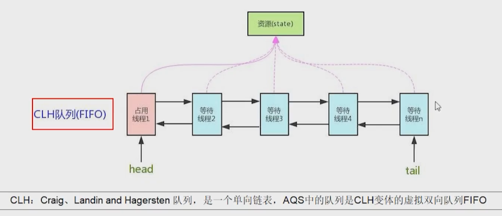

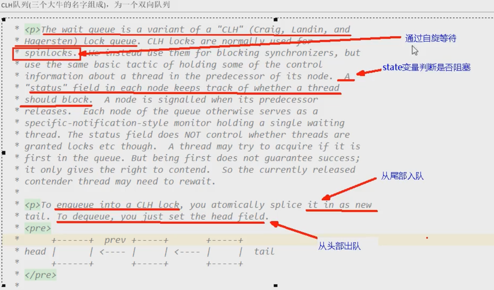

**和AQS有关的**

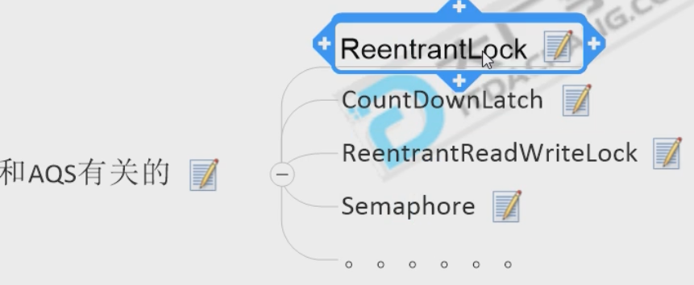

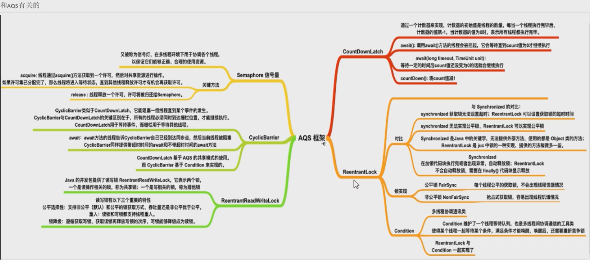

**理解锁和同步器的关系：**

锁：面向锁的使用者。定义了程序员和锁交互的使用层API，隐藏了实现细节，调用即可。

同步器：面向锁的实现者。比如Java并发大神DougLee，提出统一规范并简化了锁的实现，屏蔽了同步状态管理、阻塞线程排队和通知、唤醒机制。

**为什么需要AQS：**

加锁会导致阻塞：有阻塞就需要排队，实现排队必然需要有某种形式的队列来进行管理

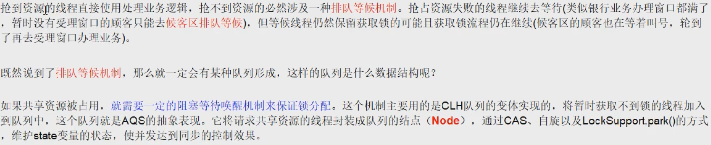

**AQS官网解释：**

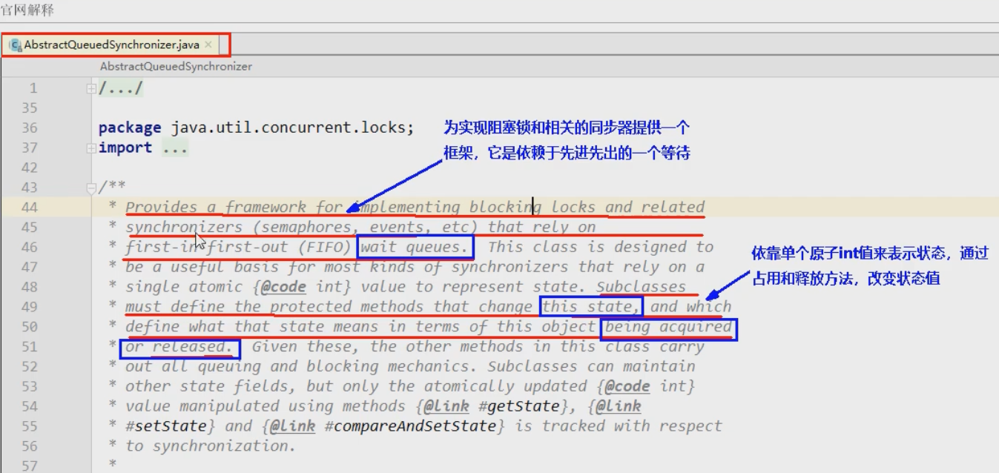

**AQS内部体系架构：**

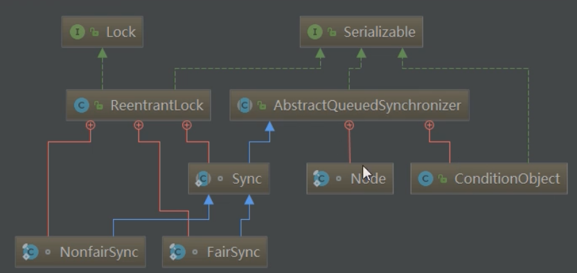

## AQS内部的Node类

Node类中有一个Node的int变量：Node的等待状态<font color="red">waitState</font>成员变量（volatile int waitState）。这是等候区其他线程的等候状态

==Node = waitState + 前后指针指向==

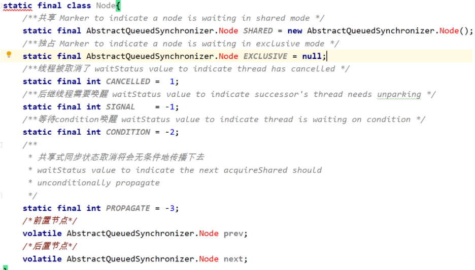

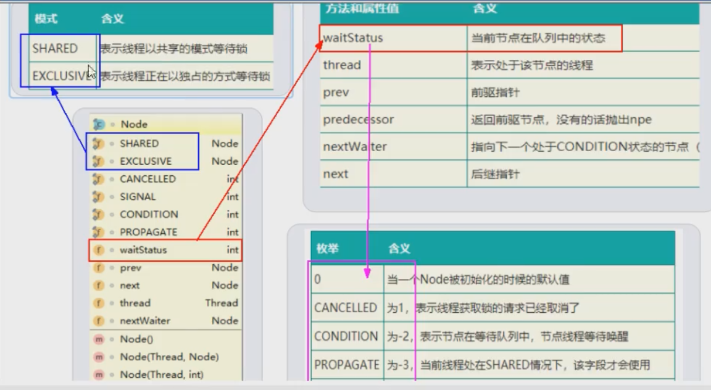

## AQS同步队列的基本结构

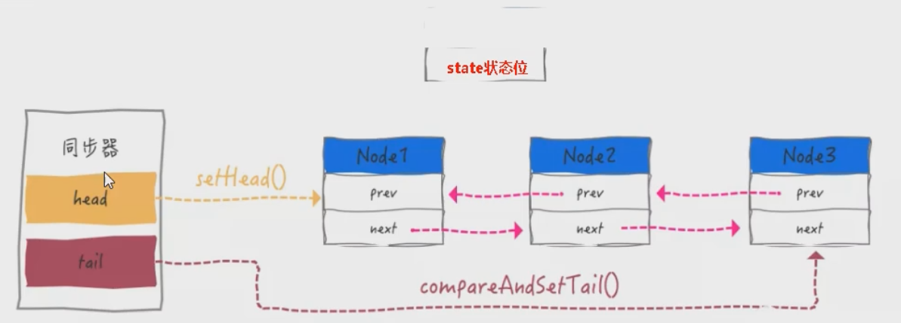

## 从ReentrantLock开始解读AQS

Lock接口的实现类，基本都是通过聚合了一个队列同步器的子类完成访问控制的

```java
ReentrantLock reentrantLock = new ReentrantLock(); // 默认是非公平锁
ReentrantLock reentrantLock = new ReentrantLock(true); // 是公平锁
```

公平锁：公平锁则在于每次都是依次从队首取值。

非公平锁：在等待锁的过程中， 如果有任意新的线程妄图获取锁，都是有很大的几率直接获取到锁的。

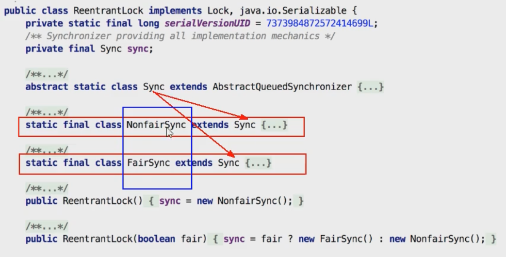

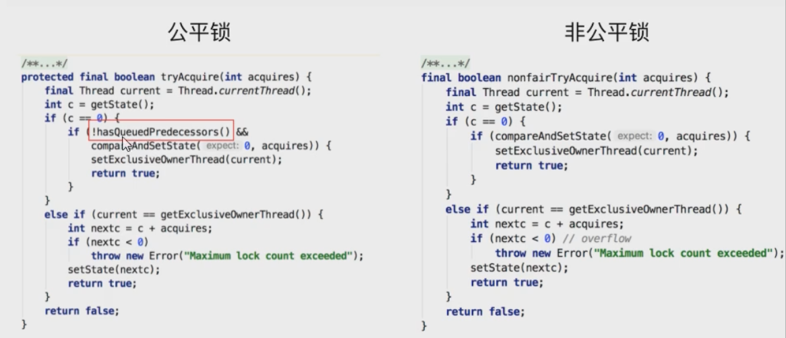

由上图公平锁与非公平锁的代码对比，可以明显看出公平锁和非公平锁的lock()方法唯一的区别就在于<font color="red">公平锁在获取同步状态时比非公平锁多了一个限制条件：!hasQueuedPredecessors()</font>。hasQueuedPredecessors()是公平锁加锁时判断队列中是否存在有效节点的方法。

hasQueuedPredecessors()中判断了是否需要排队，导致公平锁和非公平锁的差异如下：

公平锁：公平锁讲究先来先到，线程在获取锁时，如果这个锁的等待队列中已经有线程在等待，那么当前线程就会进入等待队列中；

非公平锁：不管是否有等待队列，如果可以获取锁，则立刻占有锁对象。也就是说队列的第一个排队线程在unpark()，之后还是需要竞争锁（存在线程竞争的情况下）

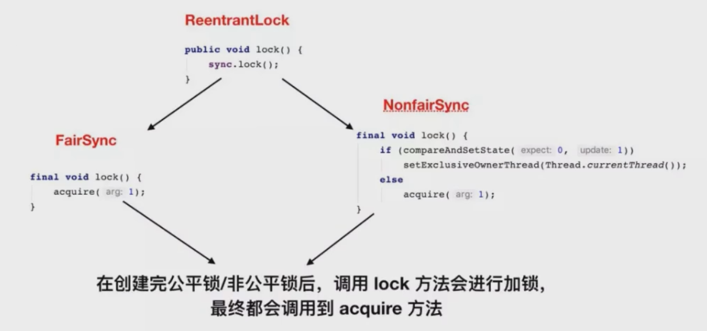

**代码例子：**

```java
public class AQSDemo {
    public static void main(String[] args) {
        ReentrantLock lock = new ReentrantLock();
        //带入一个银行办理业务的案例来模拟我们的AQS如何进行线程的管理和通知唤醒机制
        //3个线程模拟3个来银行网点,受理窗口办理业务的顾客
        //A顾客就是第一个顾客,此时受理窗口没有任何人,A可以直接去办理
        new Thread(() -> {
                lock.lock();
                try{
                    System.out.println("-----A thread come in");

                    try { TimeUnit.MINUTES.sleep(20); }catch (Exception e) {e.printStackTrace();}
                }finally {
                    lock.unlock();
                }
        },"A").start();

        //第二个顾客,第二个线程---》由于受理业务的窗口只有一个(只能一个线程持有锁),此时B只能等待,
        //进入候客区
        new Thread(() -> {
            lock.lock();
            try{
                System.out.println("-----B thread come in");
            }finally {
                lock.unlock();
            }
        },"B").start();

        //第三个顾客,第三个线程---》由于受理业务的窗口只有一个(只能一个线程持有锁),此时C只能等待,
        //进入候客区
        new Thread(() -> {
            lock.lock();
            try{
                System.out.println("-----C thread come in");
            }finally {
                lock.unlock();
            }
        },"C").start();
    }
}

```

> 我相信你应该看过源码了,那么AQS里面有个变量叫State,它的值有几种？3个状态:没占用是0,占用了是1,大于1是可重入锁
> 如果AB两个线程进来了以后,请问这个总共有多少个Node节点？答案是3个,其中队列的第一个是傀儡节点(哨兵节点)
>
> 在双向链表中，<font color="red">第一个节点为虚节点（也叫哨兵节点）</font>，其实并不存储任何信息，只是占位。真正的第一个有数据节点是从第二节点开始的。
>
> A占有锁，B在队列中等待：
>
> 队列中第一个节点并不是B线程，而是一个哨兵节点，用来占位
>
> 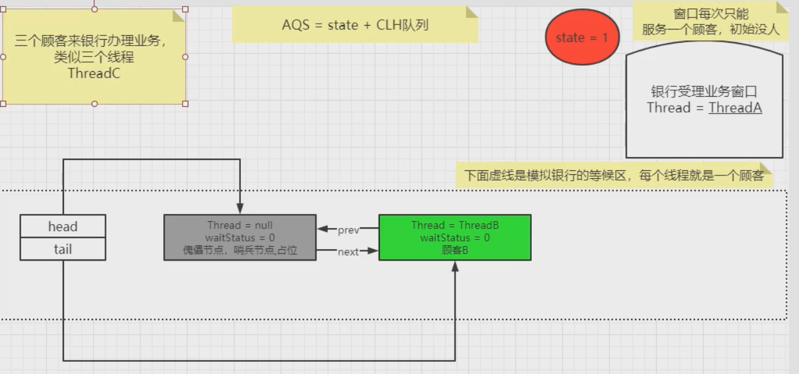
>
> 在过程中，waitStatus的值会变为-1
>
> A还是持有锁，B也在队列等待，C也进入队列等待：
>
> 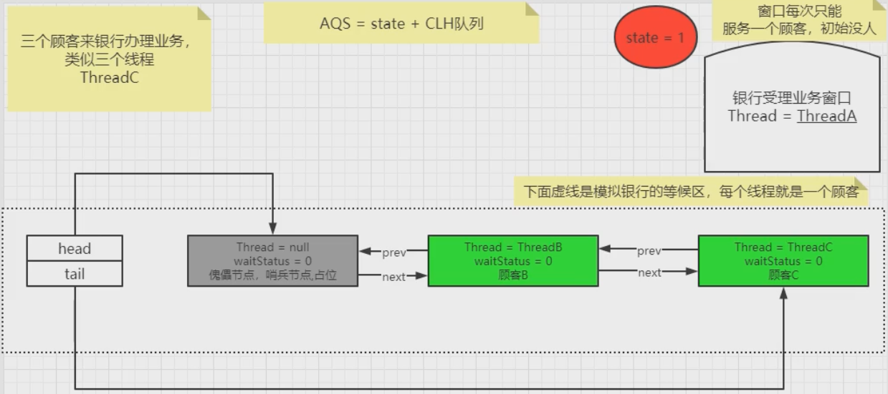
>
> A释放锁后，B占有锁，C还在队列等待
>
> 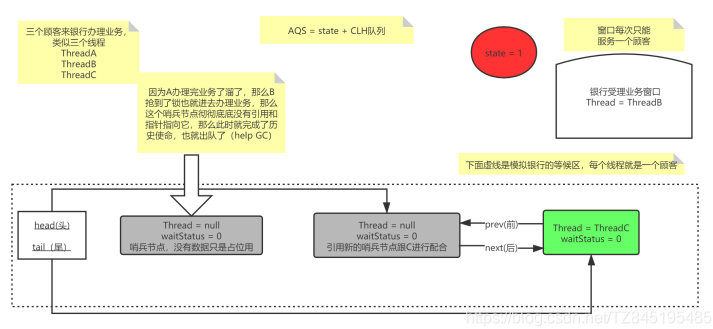


**主要方法：**

> **lock.lock()**源码：
>
> 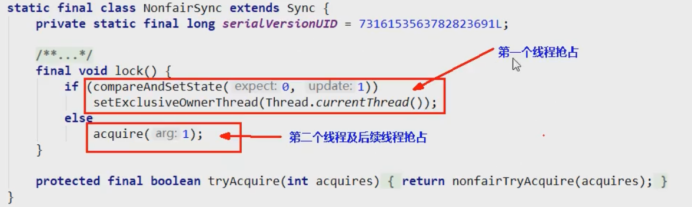
>
> **acquire()**三大流程走向：
>
> 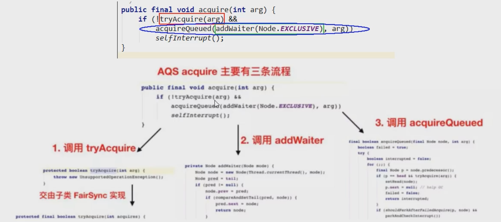
>
> **tryAcquire(arg)**
>
> **addWaiter(Node.EXCLUSIVE)**
>
> **acquireQueued(addWaiter(Node.EXCLUSIVE), arg):**
>
> 假如再抢抢失败了，就会进入shouldParkAfterFailedAcquire和parkAndCheckInterrupt方法中
>
> ​	shouldParkAfterFailedAcquire：如果前驱节点的waitStatus是SIGNAL状态，即shouldParkAfterFailedAcquire方法会返回true，程序会继续向下执行parkAndCheckInterrupt方法，用于将当前线程挂起
>
> ​	parkAndCheckInterrupt：使用了LockSupport

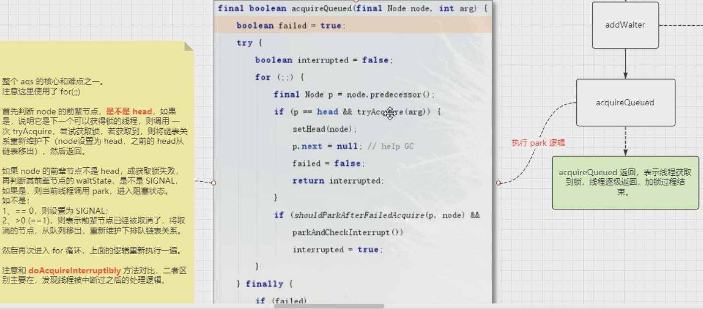

# 9、spring aop的顺序

==spring4==

正常执行：环绕通知 -----> @Before（前置通知）----> 环绕通知 ----> @After（后置通知）  ----> @AfterReturning（正常返回）

异常执行：环绕通知 -----> @Before（前置通知） ---- > @After（后置通知）  ----> @AfterThrowing（方法异常）

==spring5==

正常执行：环绕通知 -----> @Before（前置通知）----> @AfterReturning（正常返回） ----> @After（后置通知）----->  环绕通知  

异常执行：环绕通知 -----> @Before（前置通知） ----> @AfterThrowing（方法异常）---- > @After（后置通知 ）


下图左边两个是spring4和5正常执行的结果，右边是异常执行的结果，从中可以看出aop的执行顺序发生了变化。


# 10、spring循环依赖

==循环依赖==：多个bean之间相互依赖，形成了闭环。比如：A依赖于B，B依赖于C，C依赖于A，如下述代码。

通常来说，如果问spring容器内部如何解决循环依赖，<font color="red">一定是指默认的单例Bean中</font>，属性互相引用的场景。

```java
public class T1{
    class A{
        B b;
    }
    class B{
        C c;
    }
    class C{
        A a;
    }
}
```

AB循环依赖问题只要A的注入方式是setter且是==singleton（单例）==,就不会有循环依赖问题。

**循环依赖现象在spring容器中注入依赖的对象，有两种情况：**

- 构造器方式注入依赖：使用这种方法可能导致循环依赖，这种方式无法解决循环依赖

  ```java
  @Component
  pubcli class ServiceB{
      private ServiceA serviceA;
      
      public ServiceB(ServiceA serviceA){
          this.serviceA=serviceA;
      }
  }
  @Component
  pubcli class ServiceA{
      private ServiceB serviceB;
      
      public ServiceA(ServiceB serviceB){
          this.serviceB=serviceB;
      }
  }
  public class Test{
      public static void main(String[] args){
      	new ServiceA(new ServiceB(new ServiceA)......); // 因为是以构造方式，所以需要new对象时需要传入另一个对象，而且是需要一直循环传入，因此无法解决循环依赖
  	}
  }
  ```

- 以setter方式注入依赖：

  ```java
  @Component
  pubcli class ServiceB{
      private ServiceA serviceA;
      
      public void setServiceA(ServiceA serviceA){
          this.serviceA=serviceA;
      }
  }
  @Component
  pubcli class ServiceA{
      private ServiceB serviceB;
      
      public void setServiceB(ServiceB serviceB){
          this.serviceB=serviceB;
      }
  }
  public class Test{
      public static void main(String[] args){
      	ServiceA a = new ServiceA();
          ServiceB b = new ServiceB();
          // 将serviceB注入到serviceA中
          a.setServiceB(b);
          // 将serviceA注入到serviceB中
          b.setServiecA(a);
  	}
  }
  ```

**spring内部通过3级缓存来解决循环依赖---->DefaultSingletonBeanRegistry**

第一级缓存（也叫单例池）singletonObjects：存放已经经历了完整生命周期的Bean对象

第二级缓存：earlySingletonObjects，存放早期暴露出来的Bean对象，Bean的生命周期未结束（属性还未填充完）

第三级缓存：Map<String,ObjectFactory<?>> singletonFactories，存放可以生成Bean的工厂

结论：只有单例的bean会通过三级缓存提前暴露来解决循环依赖的问题，而非单例的bean，每次从容器中获取都是一个新的对象，都会重新创建，所以非单例的bean是没有缓存的，不会将其放到三级缓存中。

# 11、Redis

## redis传统五大数据类型

**8大类型：**String(字符类型)、Hash(散列类型)、List(列表类型)、Set(集合类型)、SortedSet(有序集合类型，简称zset)、Bitmap(位图)、HyperLogLog(统计)、GEO(地理)

**备注：**redis命令不区分大小写，但是key是区分大小写的；查看命令使用：help @ 类型名词  

### String


### hash

redis 中的 hash 对应 Java 中的**Map<String,map<k,v>>**


### list


### set(无序)


### zset(有序)

sort set应该是用跳表实现的


## 解决单机版锁的问题

### 单机锁

两种方式：两种方法根据实际需要进行选择

- 使用==synchronized==：

  ```java
  // 使用这种方式，如果抢不到锁，就会一直死等
  synchronized(this){
  	// 业务逻辑。。。
  } 
  ```

- 使用==Lock==：

  ```java
  Lock lock = new ReentrantLock();
  
  // 1、我等着觉得时间太长了，放弃等待
  // 尝试去获取锁
  if (lock.tryLock()){
      lock.lock;
      // 业务逻辑。。。
  }else{
      // 抢不到锁，执行其他业务逻辑
  }
  
  // 2、给我一个规定时间，在这个时间内拿不到锁我再放弃
  if (lock.tryLock(3L,TimeUnit.SECONDS)){
      lock.lock;
      // 业务逻辑。。。
  }else{
      // 抢不到锁，执行其他业务逻辑
  }
  ```

对于两个集群，在单机锁下，使用nginx配置负载均衡，会轮询访问不同的服务，但是在高并发下，还是可能会出现两个服务都卖了同一件商品，即出现的超卖现象。

### 分布式锁

> 分布式部署后，单机锁还是出现超卖现象，需要分布式锁

使用redis实现分布式锁

```java
// 下述代码是逐步完善的

@RestController
public class GoodController{
    
    private static final String REDIS_LOCK = "redisLock"; // 锁的名称
    
    @Autowired
    private StringRedisTemplate stringRedisTemplate;
    
    @GetMapping("/buy")
    public String buy_goods(){
        try{
             // 作为唯一固定标识
            String value = UUID.randomUUID().toString()+Thread.currentThread().getName();
       
            //setIfAbsent 相当于redis中setNX，不存在，就建锁
            // 将加锁操作和设置过期时间操作合并在一起，避免问题2的出现
            Boolean flag = stringRedisTemplate.opsForValue().setIfAbsent(REDIS_LOCK,value,10L,TimeUnit.SECONDS);

            // 添加过期时间，这里是10秒过后，如果没有释放锁，则会自动删除，避免问题1的出现
            // 在执行完上一行setIfAbsent操作后再添加过期时间，无法执行原子性，因此得修改
            // stringRedisTemplate.expire(REDIS_LOCK,10L,TimeUnit.SECONDS);
            
            // 建锁失败
            if(!flag){
                return "抢锁失败";
            }
            // 建锁成功

            String result = stringRedisTemplate.opsForValue().get("goods:001"); // 从redis中取值
            int goodNumber = result == null ? 0:Integer.parseInt(result);
            int realNumer = goodNumber -1;
            stringRedisTemplate.opsForValue().set("goods:001",String.valueOf(realNumer)); // 修改redis中的值
        }finally{
             // 用完后要解锁
            // 由于在上述代码中可能会出现异常，导致无法走到释放锁这步，也就无法释放锁，因此必须在代码层面添加finally释放锁
            // 需要判断当前锁是不是自己的，避免问题3的出现
            // 判断加锁与解锁是不是同一个客户端
            
            /*
            
            if (stringRedisTemplate.opsForValue().get(key).equals(values)){
                // 如果在此时，这把锁突然不是这个客户顿的，则会无解锁
                stringRedisTemplate.delete(REDIS_LOCK);
            }
            */
            
            // 经两行代码换成下述代码，避免问题4的出现
            while(true){
                // 监控锁,如果在这个过程中有其他线程掺和进来了，则进行第二次，直到删除
                stringRedisTemplate.watch(REDIS_LOCK);
                if(stringRedisTemplate.opsForValue().get(REDIS_LOCK).equalsIgnoreCase(values)){
                    stringRedisTemplate.setEnableTransactionSupport(true); // 是否支持事务
                    stringRedisTemplate.multi(); // 开启事务
                    stringRedisTemplate.delete(REDIS_LOCK);  // 删除锁
                    List<Object> list = stringRedisTemplate.exec();  // 执行，返回队列
                    // 为空说明有其他线程掺和，需要再次进行
                    if (list == null){
                        continue;
                    }
                    // 解锁，退出监控
                    stringRedisTemplate.unwatch();
                    break;         
                }
            }
        }
                             
    }
}

```

如果出现以下**问题1**：部署了微服务jar包的机器挂了，代码层面根本没有走到finally这块

解决办法：没有办法保证解锁，这个key没有被删除，需要加入一个过期时间限定key

```java
stringRedisTemplate.expire(REDIS_LOCK,10L,TimeUnit.SECONDS);
```

在问题1的基础上存在**问题2**：单独设置的过期时间不具有原子性

解决办法：将建锁设置key操作和设置过期时间合并成同一行

```java
Boolean flag = stringRedisTemplate.opsForValue().setIfAbsent(REDIS_LOCK,value,10L,TimeUnit.SECONDS);
```

在问题2的基础上存在**问题3**：删除了其他线程的锁

这是由于当前线程A执行的时间超过了设置的过期时间，导致redis删除了线程A的锁，此时线程A并没有结束，但由于没有了锁，因此其他线程B就可以进入程序，重新加锁，当A继续执行，走到finally去释放锁时，释放的却是线程B的锁

解决办法：线程只能删除自己的锁，添加判断，判断当前锁是不是自己的

```java
if (stringRedisTemplate.opsForValue().get(key).equals(values)){
    stringRedisTemplate.delete(REDIS_LOCK);
}
```

在问题3的基础上存在**问题4**：finally块的判断和删除操作不是原子性的（如果不用lua脚本，还有其他办法吗）

解决办法1：使用redis事务

```java
while(true){
    // 监控锁,如果在这个过程中有其他线程掺和进来了，则进行第二次，直到删除
    stringRedisTemplate.watch(REDIS_LOCK);
    if(stringRedisTemplate.opsForValue().get(REDIS_LOCK).equalsIgnoreCase(values)){
        stringRedisTemplate.setEnableTransactionSupport(true); // 是否支持事务
        stringRedisTemplate.multi(); // 开启事务
        stringRedisTemplate.delete(REDIS_LOCK);  // 删除锁
        List<Object> list = stringRedisTemplate.exec();  // 执行，返回队列
        // 为空说明有其他线程掺和，需要再次进行
        if (list == null){
            continue;
        }
        // 解锁，退出监控
        stringRedisTemplate.unwatch();
        break;         
    }
}
```

解决办法2：使用Lua脚本（替换上述的while循环）


```java
// RedisUtils类如上图所示
Jedis jedis = RedisUtils.getJedis();
// Lua脚本
String script = "if redis.call('get',KEYS[1]) == ARGV(1)" +
    "then " +
    "return redis.call('del',KEYS[1]) " +
    "else " +
    "   return 0 " +
    "end";

try{
    Object o = jedis.eval(script,Collections.singletonList(REDIS_LOCK),Collections.singletonList(value));
    if ("1".equals(o.toString()))
        System.out.println("删除成功");
    else
        System.out.println("删除失败");

        
}finally{
    if (jedis != null){
        jedis.close();
    }
}

```

在问题4的基础上存在**问题5**：确保redisLock过期时间大于业务执行时间的问题，即==Redis分布式锁==如何续期?

CAP：一致性（Consistency）、可用性（Availability）、分区容错性（Partition tolerance）

Redis：属于AP，主机OK了，马上返回，不管从节点。在redis集群中，可能会发生：redis异步复制造成的锁丢失，比如主节点没来得及把刚刚set进来的这条数据给从节点，就挂了

zookeeper：属于CP，等从节点全部OK了，主机才返回

在redis集群环境下，使用RedLock之Redisson落地实现

```java
// 先配置RedisConfig.java 
@Bean
public Redisson redisson(){
    Config config = new Config();
    config.useSingleServer().setAddress("redis://192.168.111.147:6379").setDatabase(0);
    
    return (Redisson)Redisson.create(Config);
}
```

```java
@RestController
public class GoodController{
    
    private static final String REDIS_LOCK = "redisLock"; // 锁的名称
    
    @Autowired
    private StringRedisTemplate stringRedisTemplate;
    
    @Autowired
    private Redisson redisson; // 使用reidsson
    
    @GetMapping("/buy")
    public String buy_goods(){
        try{
             // 作为唯一固定标识
            String value = UUID.randomUUID().toString()+Thread.currentThread().getName();
       		
            RLock redissonLock = redisson.getLock(REDIS_LOCK);
            redissonLok.lock();


            String result = stringRedisTemplate.opsForValue().get("goods:001"); // 从redis中取值
            int goodNumber = result == null ? 0:Integer.parseInt(result);
            int realNumer = goodNumber -1;
            stringRedisTemplate.opsForValue().set("goods:001",String.valueOf(realNumer)); // 修改redis中的值
        }finally{
            // 判断还是锁定状态
            if (redissonLock.isLocked()){
                // 判断锁是被当前线程持有
                if (redissonLock.isHeldByCurrentThread()){
                    redissonLok.unlock(); // 尽量不要直接使用unlock(),会出现当前线程和解锁线程不是同一个的错误
                }
            }
            
        }
                             
    }
}

```

## redis内存调整查看

### 查看redis最大占用内存


### redis默认内存

如果不设置最大内存大小或者设置最大内存大小为0，在64位操作系统下不限制内存大小，在32位操作系统下最多使用3GB内存

### 一般生产上如何配置

一般推荐Redis设置内存为最大物理内存的四分之三

### 如何修改redis内存设置

通过修改文件配置：在查看redis最大占用内存的配置文件中修改，maxmemory 104857600  (1024 * 1024 * 100) 100M

通过命令修改：config set memory 1    ;    config get memory

查看redis内存使用情况：info memory

### redis内存满了


## redis缓存淘汰策略

如果一个键快要过期了，它到了过期时间之后==并不是==马上就从内存中删除。它是有三种不同的删除策略。

### 过期键的删除策略

==定时删除：==这种方法对CPU不友好，用处理器性能换取存储空间（拿时间换空间）


==惰性删除：==对内存不友好，用存储空间换取处理器性能（拿空间换时间）


==定期删除：==定期抽样key，判断是否过期，但是依旧有漏网之鱼


### 内存淘汰策略

有以下八种策略，默认使用noevict ion

一般使用allkeys-lru，在配置文件中配置：maxmemory- policy allkeys- lru，或者使用命令：config set maxmemory- policy allkeys- lru


## redis的LRU算法

LRU是Least Recently Used的缩写，即最近最少使用，是一种常用的页面 置换算法，选择最近最久未使用的数据予以淘汰

### 设计思想

LRU的算法核心是==哈希链表==，本质就是HashMap+DoubleLinkedList，时间复杂度是o(1)，哈希表+双向链表的结合体


### 使用LinkedHashMap完成LRU算法

```java
import java.util.LinkedHashMap;
import java.util.Map;

public class LRUCacheDemo<k,v> extends LinkedHashMap<k,v> {
    private int capacity; // 缓存坑位

    @Override
    protected boolean removeEldestEntry(Map.Entry<k, v> eldest) {
        return super.size() > capacity;  // size大于capacity,则最近最少使用的remove
    }

    /*
    参数accessOrder:
        为true：access-order,按照使用顺序
        为false：insertion-order，按照插入顺序
     */
    public LRUCacheDemo(int capacity){
        super(capacity,0.75F,false);
        this.capacity = capacity;
    }

    public static void main(String[] args) {
        LRUCacheDemo lRUCacheDemo = new LRUCacheDemo(3);
        lRUCacheDemo.put(1,"a");
        lRUCacheDemo.put(2,"b");
        lRUCacheDemo.put(3,"c");
        System.out.println(lRUCacheDemo.keySet());
        lRUCacheDemo.put(4,"d");
        System.out.println(lRUCacheDemo.keySet());
        lRUCacheDemo.put(3,"c");
        System.out.println(lRUCacheDemo.keySet());
        lRUCacheDemo.put(3,"c");
        System.out.println(lRUCacheDemo.keySet());
        lRUCacheDemo.put(3,"c");
        System.out.println(lRUCacheDemo.keySet());
        lRUCacheDemo.put(5,"x");
        System.out.println(lRUCacheDemo.keySet());

        /*
        accessOrder:
            为true时的结果为：
            [1, 2, 3]
            [2, 3, 4]
            [2, 4, 3]
            [2, 4, 3]
            [2, 4, 3]
            [4, 3, 5]
            false时的结果为：
            [1, 2, 3]
            [2, 3, 4]
            [2, 3, 4]
            [2, 3, 4]
            [2, 3, 4]
            [3, 4, 5]
         */

    }

}

```

### 手写LRU算法

```java
import java.util.HashMap;
import java.util.Map;

public class LRUCacheDemo2 {
    // map负责查找，构建一个虚拟的双向链表，它里面安装的就是一个个Node节点，作为数据载体

    // 1、构建一个Node节点，作为数据载体
    class Node<k,v>{
        k key;
        v value;
        Node<k,v> prev;  // 有prev和next，说明是双向链表
        Node<k,v> next;

        public Node(){
            this.prev=this.next=null;
        }
        public Node(k key,v value){
            this.key = key;
            this.value = value;
            this.prev= this.next=null;
        }
    }
    // 2、构造一个虚拟的双向链表，里面安放的是我们的Node
    class DoubleLinkedList<k,v>{
        Node<k,v> head;
        Node<k,v> tail;

        // 2.2 构造方法
        public DoubleLinkedList(){
            head = new Node<>();
            tail = new Node<>();
            head.next = tail;
            tail.next = head;
        }

        // 2.2 添加到头
        public void addHead(Node<k,v> node){
            node.next  = head.next;
            node.prev = head;
            head.next.prev = node;
            head.next = node;
        }

        // 2.3 删除节点
        public void removeNode(Node<k,v> node){
            node.next.prev = node.prev;
            node.prev.next = node.next;
            node.prev = null;
            node.next = null;
        }

        // 2.4 获得最后一个节点
        public Node getLast(){
            return tail.prev;
        }

    }

    private int cacheSize;
    Map<Integer,Node<Integer,Integer>> map;
    DoubleLinkedList<Integer,Integer> doubleLinkedList;

    public LRUCacheDemo2(int cacheSize){
        this.cacheSize = cacheSize;  // 坑位
        map = new HashMap<>(); // 查找
        doubleLinkedList = new DoubleLinkedList<>();
    }

    public int get(int key){
        if (!map.containsKey(key))
            return -1;
        Node<Integer,Integer> node = map.get(key);
        doubleLinkedList.removeNode(node);
        doubleLinkedList.addHead(node);
        return node.value;
    }

    public void put(int key,int value){
        if (map.containsKey(key)){
            Node<Integer,Integer> node = map.get(key);
            node.value = value;
            map.put(key,node);

            doubleLinkedList.removeNode(node);
            doubleLinkedList.addHead(node);
        }
        else {
            if (map.size() == cacheSize) // 坑位满了
            {
                Node<Integer,Integer> lastNode = doubleLinkedList.getLast();
                map.remove(lastNode.key);
                doubleLinkedList.removeNode(lastNode);
            }
            // 新增
            Node<Integer,Integer> newNode = new Node<>(key,value);
            map.put(key,newNode);
            doubleLinkedList.addHead(newNode);
        }
    }

    public static void main(String[] args) {
        LRUCacheDemo2 lRUCacheDemo = new LRUCacheDemo2(3);
        lRUCacheDemo.put(1,1);
        lRUCacheDemo.put(2,2);
        lRUCacheDemo.put(3,3);
        System.out.println(lRUCacheDemo.map.keySet());
        lRUCacheDemo.put(4,4);
        System.out.println(lRUCacheDemo.map.keySet());
        lRUCacheDemo.put(3,2);
        System.out.println(lRUCacheDemo.map.keySet());
        lRUCacheDemo.put(3,3);
        System.out.println(lRUCacheDemo.map.keySet());
        lRUCacheDemo.put(3,3);
        System.out.println(lRUCacheDemo.map.keySet());
        lRUCacheDemo.put(5,5);
        System.out.println(lRUCacheDemo.map.keySet());

        /*
        结果为：说明跟false的情况相同
        [1, 2, 3]
        [2, 3, 4]
        [2, 3, 4]
        [2, 3, 4]
        [2, 3, 4]
        [3, 4, 5]
         */
        /*
        accessOrder:
            为true时的结果为：
            [1, 2, 3]
            [2, 3, 4]
            [2, 4, 3]
            [2, 4, 3]
            [2, 4, 3]
            [4, 3, 5]
            false时的结果为：
            [1, 2, 3]
            [2, 3, 4]
            [2, 3, 4]
            [2, 3, 4]
            [2, 3, 4]
            [3, 4, 5]
         */


    }
}

```

# 12、MySQL原理

## 索引

数据库索引，是数据库管理系统中一个排序的数据结构，以协助快速查询、更新数据库表中数据。

索引也占用内存空间


### 索引类型

**Normal（普通索引）**：没有任何约束、限制

**Unique（唯一索引）**：要求索引的字段中不能有重复的值，可以存在一个为空的索引，而主键索引比唯一索引多的一点就是不能存在为空的索引

**FullText（全文索引）**：针对存放的大文本需要使用 like 去匹配内容，但是使用了全文索引后，就不需要使用 like，全文索引有自己的方式

​	select * from fulltext_test where match(content) against('你好' IN NATURAL LANGUAGE MODE);

### 索引方法

**BTREE**：通常用B树

**HASH**：只支持等值的查询，不支持大于小于等其他查询方法；也可能出现hash冲突

### 索引数据结构

二叉查找树-----> ==平衡二叉树（AVL==）

使用AVL存储，需要存储三部分：键值、数据磁盘地址、子节点引用


InnoDB加载一次磁盘大小是16KB，树中一个节点就需要进行一次IO操作，节点的大小就是16KB=16384 bytes，这样容易浪费内存

==多路平衡查找树（B Tree）==


==加强版多路平衡查找树（B+树）==

所有的数据都存放在叶子节点上，由此查找所有数据所经历的IO次数都是相同的

**特点：**B Tree能解决的问题，B+Tree都能解决；扫库扫表能力更强；磁盘读写能力更强；排序能力更强；效率更加稳定；


### 存储引擎

存储引擎==表类型，其实就是存储数据，管理数据的方式。

mysql的存储引擎有：

- InnoDB：5.5版本之后默认的。支持行级别的锁，更细粒度的锁定

- MyISAM：5.5版本之前默认的存储引擎，只支持表级别的锁，不支持事务，没办法保证数据的一致性

- Memory：把数据全部放到内存中，重启的话数据马上就丢失

- CSV：纯文本格式，在不同系统之间交换数据

- Archive：归档的数据，不支持索引的数据

==InnoDB==：

**.frm** ：各种引擎都有的

**.ibd**：数据和索引在一个文件中。把数据放到了叶子节点中，索引是数据，数据也是索引，

聚集索引是决定了数据物理存放顺序的索引，聚集索引一定存在。

有主键索引的时候，主键索引就是聚集索引；没有的话，就会去尝试寻找第一个没有空值的唯一索引当做聚集索引；如果都没有，则会把row_id行号当做聚集索引


在这里面索引分为主键索引和辅助索引：

​	主键索引存放存储索引和数据，辅助索引存放存储索引和主键值

使用辅助索引会多扫描一棵B+树，因此效率没有主键索引高


==MyISAM==：一个索引就是一个B+树，索引都在MYI文件里面

**.frm** **：各种引擎都有的

**.MYD**： D 代表 Data 数据

**.MYI**： I 代表 Index 索引


### 建了索引但是不用

列的离散度：离散度=不重复值的个数：总个数，列的重复度要小，即要在散列度越高的字段建立索引

联合索引最左匹配：必须从第一个字段开始，并且不能中断（但是mysql中存在优化器optimizer，如果使用了索引中的所有字段，则会自动调整位置）


覆盖索引：select的列包含在了用到索引里面的时候，可以减少回表

回表：使用辅助索引去查询数据，多扫描一棵B+树的过程，这个动作就叫回表

==有索引但是用不到索引的情况：==

- 在索引列使用函数或者表达式、计算。例如：。。。where id+1=5 ，用不到，改成 。。。where id = 5-1就用到了

- 字符串不加引号，出现隐式转换。例如：。。。where name=123，本来是字符串，但是没有加引号，就用不到，改为 。。。where name="123" 就好了

- like条件前面带 % （最左前缀）。例如：。。。where name "%王" ，%在最左边，不会使用索引，但是如果% 在中间或者后面 （"王%"），就可以用到索引

- 负向查询：NOT LIKE、!=（>、<）、NOT IN。例如：

## 页

页目录：对应不同目录的起始位置，用于加快查询速度，利用空间换时间的思想实现，在页目录中可以使用二分查找法确定属于哪一组，在哪个目录下


如果有多页的话，会遍历每一页的目录，速度会很慢，为此可以添加一个类似于页目录的新页（数组），用于存放每一页的页目录的最小值

下面是==主键索引==：1 3 5 7是主键，叶子节点是数据（五个数字分别代表的是：abcde，其中abcd是int，e是varchar）a是主键


下面是==联合索引==，叶子节点中的值是对应的主键，用于通过主键到主键索引中去查找完整的数据，因此不需要重复保存数据

对于**bcd字段联合索引**，如果条件是c=1 and d=2，没有给出b的值，即 *12，由于最左匹配原则存在，此时并不会走索引，而且会进行全表扫描

索引条件下退：

​	5,7版本之前，如果是找 1*1，走联合索引会先根据a=1找到叶节点为1和2，然后根据1和2分别去主键索引中根据d=1查找数据

​	5.7保本之后，则是会先根绝 1*1，先到联合索引中根据a=1,d=1匹配到最合适的，也就是叶节点为1，直接根据1到主键索引中找数据

对于select * from t1 where b>1，因为查询的是所有，所以不会走联合索引，会走全表扫描

但是如果是select b,c,d,a from t1 where b>1，则由于查询的是联合索引中的字段以及主键字段，所以会走索引

如果是select b,c,d,a,e from t1 where b>1。则是会走全表扫描

select b from t1，也会走联合索引


 # 13、spring常用注解


# 14、MySQL三大日志

mysql日志主要包括错误日志、查询日志、慢查询日志、事务日志、二进制日志几大类。作为开发，我们重点需要关注的是二进制日志(binlog)和事务日志(包括redo log和undo log)。

- 逻辑日志：可以简单理解为记录的就是sql语句。
- 物理日志：因为mysql数据最终是保存在数据页中的，物理日志记录的就是数据页变更。

## binlog（二进制日志）

binlog用于记录数据库执行的写入性操作(不包括查询)信息，以二进制的形式保存在磁盘中。binlog是mysql的逻辑日志，并且由Server层进行记录，使用任何存储引擎的mysql数据库都会记录binlog日志。

## redo log（重做事务日志）

redo log包括两部分：一个是内存中的日志缓冲(redo log buffer)，另一个是磁盘上的日志文件(redo log file)。mysql每执行一条DML语句，先将记录写入redo log buffer，后续某个时间点再一次性将多个操作记录写到redo log file。

redo log实际上记录数据页的变更，而这种变更记录是没必要全部保存，因此redo log实现上采用了大小固定，循环写入的方式，当写到结尾时，会回到开头循环写日志。

## undo log（回滚事务日志）

数据库事务四大特性中有一个是原子性，具体来说就是原子性是指对数据库的一系列操作，要么全部成功，要么全部失败，不可能出现部分成功的情况。

实际上，原子性底层就是通过undo log实现的。undo log主要记录了数据的逻辑变化，比如一条INSERT语句，对应一条DELETE的undo log，对于每个UPDATE语句，对应一条相反的UPDATE的undo log，这样在发生错误时，就能回滚到事务之前的数据状态。

## **redo log与binlog区别**

由binlog和redo log的区别可知：binlog日志只用于归档，只依靠binlog是没有crash-safe能力的。但只有redo log也不行，因为redo log是InnoDB特有的，且日志上的记录落盘后会被覆盖掉。因此需要binlog和redo log二者同时记录，才能保证当数据库发生宕机重启时，数据不会丢失。

# 15、线程池的使用

工作线程数是不是设置的越大越好？

不是。存在线程切换的开销，如果线程数目多，则开销也多。

**场景一：博客文章浏览量**

查看查看文章的controller中，查看完文章后，本应该直接返回数据，但这时做了一个更新操作，将浏览量更新了。由于更新时加写锁，会阻塞其他的读操作，性能就会比较低。更新增加了此次接口的耗时，如果一旦更新出现问题，不能影响查看文章的操作。

这时就可以使用线程池，可以把更新操作丢到线程池中去执行，和主线程不相关了。

controller：

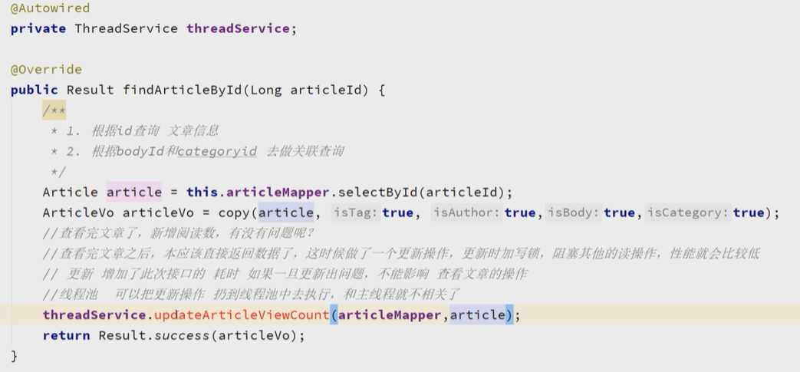

线程池配置：

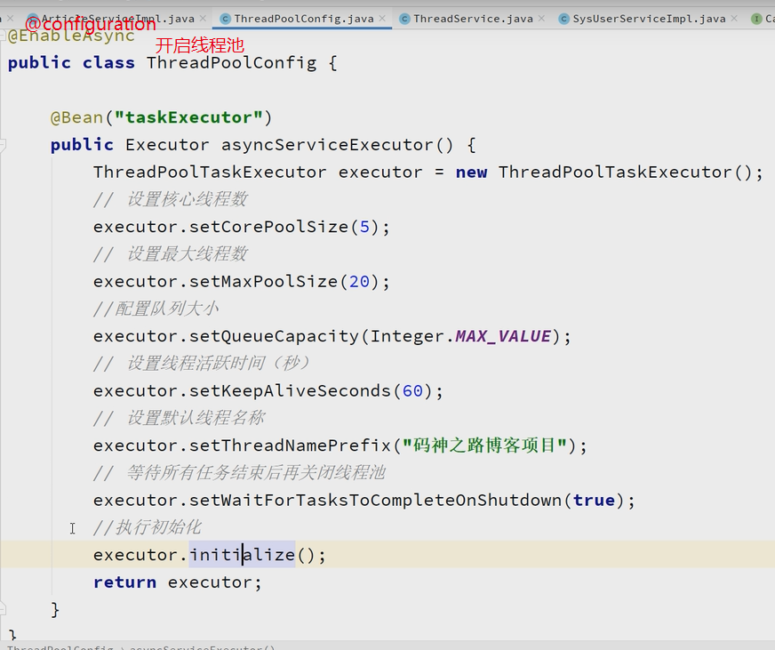

线程池service： 将更新浏览量的操作写到这个方法中，在这里的操作不会影响主线程。

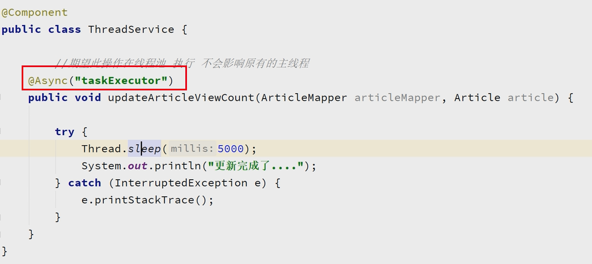


